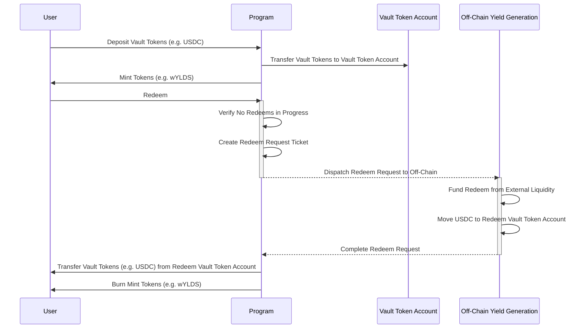
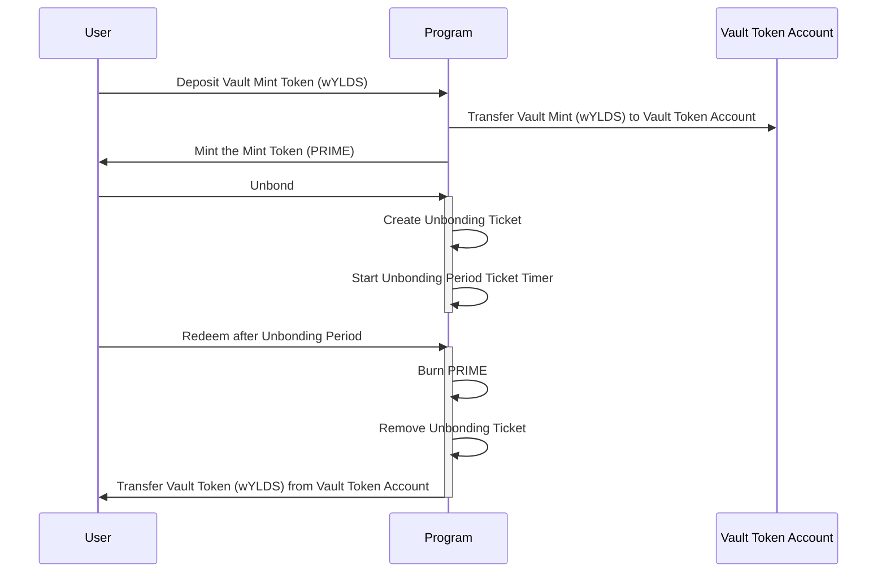

# Hastra Vault Protocol on Solana

The Hastra Vault protocol is derived of 2 Solana programs that implement a deposit and mint protocol and a staking protocol. Hastra Vault protocol allows users to swap tokens like USDC for mint tokens (e.g. wYLDS) at a 1:1 ratio. Vaulted tokens are held in a vault, while mint tokens provide liquidity and transferability. Users can then use their mint tokens in DeFi applications, trade them, or hold them for rewards. The Hastra Vault protocol staking program allows mint token holders deposit to the staking program and earn larger off-chain yield but are bound to a bonding period.

## Core Architecture

**Deposit Mechanism:**
- Users deposit vault tokens (e.g. USDC) into a program-controlled vault
- Program mints equivalent mint tokens (e.g. wYLDS) that maintain 1:1 parity
- Users can trade/transfer mint tokens freely

The **rewards process** in this Solana vault protocol involves off-chain yield generation and on-chain distribution via merkle trees and proofs.

## Off-Chain Yield Generation Process

**Yield Generation Flow:**
1. Vault tokens (e.g. USDC) deposited by users sits in the program-controlled vault
2. Authorized business entities use vault tokens for external investment
3. Vault tokens deployed into high-yield DeFi protocols, lending markets, or other investment vehicles
4. Yield generated from these external positions accumulates off-chain
5. Business process calculates each user's pro-rata share based on their mint token holdings and duration

## On-Chain Rewards Distribution

Rewards are distributed on-chain using a merkle tree-based claim system to ensure efficiency and security. The program is initialized with a list of reward administrators who can post new reward epochs. Each reward epoch contains a merkle root summarizing user rewards for that period.

**Epoch-Based System:**
- Rewards are distributed in discrete epochs (e.g., weekly)
- Each epoch has a unique index and merkle root representing user rewards
- Epoch duration and timing are configurable by program administrators
- Users can only claim rewards for past epochs, not the current one
- Epochs are immutable once created to ensure integrity
- Administrators can create epochs with a merkle root summarizing user rewards
- Users claim rewards by providing a merkle proof against the stored root
- Rewards are minted as additional mint tokens (e.g. wYLDS)

**Merkle Tree Structure:**
- **Leaf Node**: `sha256(user_pubkey || reward_amount_le_bytes || epoch_index_le_bytes)`
- **Tree Construction**: All user rewards for an epoch are hashed and organized into a sorted binary merkle tree
- **Root**: Final merkle root represents the entire reward distribution for that epoch

**Administrative Posting Process:**

1. Authorized reward admin computes user rewards off-chain
2. Constructs merkle tree and computes root
3. Calls `create_rewards_epoch()` with epoch index, merkle root, and total rewards:

```rust
pub fn create_rewards_epoch(
    ctx: Context<CreateRewardsEpoch>,
    index: u64,           // Epoch identifier
    merkle_root: [u8; 32], // Computed merkle root
    total: u64,           // Total rewards for verification
) -> Result<()>
```

## User Claim Process
Users claim their rewards by providing their allocated amount and a merkle proof. The program verifies the proof against the stored merkle root for the specified epoch.

**Merkle Proof Verification:**
1. User provides their allocated `amount` and merkle `proof` (array of sibling hashes)
2. Program reconstructs leaf: `sha256(user || amount || epoch_index)`
3. Program walks up the tree using proof siblings with sorted pair hashing
4. Final computed root must match the stored epoch merkle root

```rust
pub fn claim_rewards(
    ctx: Context<ClaimRewards>,
    amount: u64,
    proof: Vec<[u8; 32]>
) -> Result<()>
```

## Double-Claim Prevention

**Claim Record System:**
- Each successful claim creates a `ClaimRecord` PDA with seeds: `[b"claim", epoch.key(), user.key()]`
- Account creation constraint prevents duplicate claims:
  ```rust
  #[account(
      init,  // Fails if account already exists
      payer = user,
      space = ClaimRecord::LEN,
      seeds = [b"claim", epoch.key().as_ref(), user.key().as_ref()],
      bump
  )]
  pub claim_record: Account<'info, ClaimRecord>,
  ```

**Security Benefits:**
- **Immutable Claims**: Once created, ClaimRecord cannot be deleted or modified
- **Epoch Isolation**: Each epoch has separate claim records, preventing cross-epoch issues
- **User Isolation**: Each user has individual claim records per epoch
- **Rent Recovery**: Claim records are permanent (no close instruction), ensuring claim history preservation

This design ensures that yield generated from vault tokens is fairly distributed to mint token holders while preventing any possibility of double-claiming rewards.

## Staking Rewards

The staking program allows mint token holders to stake their tokens for additional rewards. Staked tokens are locked for a bonding period, during which they cannot be transferred or redeemed. This incentivizes long-term holding and provides stability to the vault protocol. 

The staking program issues a staking token that represents your share of the staked mint tokens. As rewards are calculated off-chain and distributed on-chain, staking tokens do not increase in quantity but rather the value of each staking token increases relative to the underlying mint tokens.

Staking rewards are published by a rewards administrator to the staking program. The staking then calls the mint program to mint additional mint tokens (e.g. wYLDS) to the staking program pool. The value of the staker's stake tokens increases as the staking pool grows relative to the total staked mint tokens. Staking rewards are redeemed when the user unbonds their stake and redeems their share of mint tokens based on their stake token holdings.

## Administrative Features

**Freeze System:**
- Designated administrators can freeze/thaw specific token accounts
- Useful for compliance, security incidents, or regulatory requirements
- Maximum 5 freeze administrators with program update authority control

**Rewards Distribution:**
- Merkle tree-based reward claims for mint token holder incentives
- Epoch-based system with configurable reward periods
- Prevents double-claiming with permanent claim records
- Rewards minted as additional mint tokens (e.g. wYLDS)

## Security Model

**Program-Controlled Assets:**
- Vault authority PDA controls all deposited vault tokens
- Mint authority PDA controls mint token issuance
- Freeze authority PDA manages account freezing capabilities

**Administrative Controls:**
- Program upgrade authority can modify configurations
- Separate administrator lists for freeze and rewards functions
- All sensitive operations require proper authority validation

**Account Structure:**
- `Config`: Program settings and administrator lists
- `RewardsEpoch`: Manages reward distribution with merkle proofs
- `ClaimRecord`: Prevents reward double-spending

** Protcol Pause and Unpause **
- Program authority can pause and unpause the protocol preventing deposit, claim, and redeem. 

This creates a secure, flexible vault protocol suitable for DeFi protocols requiring both liquidity and governance controls.

There are several different aspects to this repo, but all are related to the Vault/Mint program. We use rust (for the solana program), typescript (helpers that use the solana and anchor libs), and resource files (configurations, images, etc... that assist in setting everything up).

## Project Layout


### Core Components

**Rust Programs** (`programs/*/src/`):
- **State Management**: Account structures and program data models
- **Business Logic**: Deposit, withdrawal, rewards, and administrative functions
- **Security Layer**: Authorization guards and error handling

**TypeScript Scripts** (`scripts/*/`):
- **Deployment Tools**: Automated setup and configuration management
- **User Operations**: Deposit, redeem, and claim workflows
- **Admin Functions**: Program updates and authority management

**Generated Assets** (`target/`):
- **Program Binary**: Deployable Solana bytecode
- **Type Definitions**: TypeScript interfaces for client integration
- **IDL Files**: JSON schema for cross-platform compatibility

This modular structure separates on-chain program logic from off-chain tooling while providing comprehensive deployment and management capabilities.

## Required Libs/Utils
Like all recent projects, we have to include a bunch of boiler plate libs/utils. We'll keep a running list here, but it is best to note that this project got started by reading the https://solana.com/docs/intro/installation doc.

**Prerequisites**
- yarn
- solana w/spl-token
- anchor cli (recommend using avm to manage anchor versions)
- rust

### Yarn
`yarn install` to install node js dependencies. Don't make the mistake I did, and try to use npm.

### Anchor

To build the project with anchor, we have to install rust. It is also best to ensure you have the latest version by running `rustup update` prior to engaging in development. Anchor follows the conventional command for building the Solana programs in this repo.
```bash
$ anchor build
```

## Build and Release

> This section uses the `scripts/config.sh` script to execute commands with the correct environment variables set.
> You can also run the commands directly in your terminal, but ensure you set the `ANCHOR_PROVIDER_URL` and `ANCHOR_WALLET` environment variables correctly. 
> Refer to the `config.sh` script for examples.

### Generate a new keypair

This section assumes a fresh rollout on devnet. If you already have a keypair you want to use, skip this step.

```bash
$ solana-keygen new --no-passphrase --force --outfile ~/.config/solana/hastra-devnet-id.json
Generating a new keypair
Wrote new keypair to /Users/jd/.config/solana/hastra-devnet-id.json
================================================================================
pubkey: GusaXhaH11VvYyFvsEiaaaBw3oFUjgmVoJZswzb9cnqc
================================================================================
Save this seed phrase to recover your new keypair:
refuse detail throw curtain spell journey grab shiver assume salute recycle tube
================================================================================
```

### Fresh Rollout of the Protocol

#### Start ./scripts/config.sh

```
$ sh config.sh

Select Solana network (devnet, mainnet-beta, testnet) []: devnet

Current settings in devnet_vault.history:

sh config.sh
Select Solana network (devnet, mainnet-beta, testnet) []: devnet
Solana Keypair from config: /Users/jd/.config/solana/hastra-devnet-prime.json
Solana RPC URL from config: https://api.devnet.solana.com
Enter path to Solana wallet keypair [/Users/jd/.config/solana/hastra-devnet-prime.json]:
Enter Solana RPC URL [https://api.devnet.solana.com]:

Config File: /Users/jd/.config/solana/cli/config.yml
RPC URL: https://api.devnet.solana.com
WebSocket URL: wss://api.devnet.solana.com/ (computed)
Keypair Path: /Users/jd/.config/solana/hastra-devnet-prime.json
Commitment: confirmed

Public Key:             HT9c4xkDT9bx2JyMfLrauNmg8BA7bjUm7qba1vdMsMrz (8.34021568 SOL)

Select an action:
 1) Build Programs
 2) Deploy Programs
 3) Initialize Mint Program
 4) Initialize Stake Program
 5) Setup Metaplex
 6) Set Mint Program Mint and Freeze Authorities
 7) Set Stake Program Mint and Freeze Authorities
 8) Show Accounts & PDAs
 9) Create Mint Token
10) Create Stake Token
11) Create Mint Program Redeem Vault Token Account
12) Create Stake Program Vault Token Account
13) Exit
#?
```

#### Choose option `9` Create Mint Token

This step creates a new mint token that will be minted when users deposit the vault token (e.g. USDC). When
the program is initialized, the mint authority will be set to a PDA owned by the program.

```
Creating Mint Token...
Mint Token: 2vEiPvsJjpctLv78HACy9uQB4nm88oX8fbbfW7MaWiaB

Config File: /Users/jd/.config/solana/cli/config.yml
RPC URL: https://api.devnet.solana.com
WebSocket URL: wss://api.devnet.solana.com/ (computed)
Keypair Path: /Users/jd/.config/solana/hastra-devnet-id.json
Commitment: confirmed
```

#### Choose Option `11` Create Mint Program Redeem Vault Token Account

This step creates the token account that will hold the vault tokens when users redeem their mint tokens.
When the program is initialized, the vault authority PDA will be set as the owner of this token account.

```
Creating Redeem Vault Token Account (ATA)...
Redeem Vault Token Account: 717cmnRqL1mRYRWVqFjrNKDHtQS3neLPuAbJBZaa5ah1

Config File: /Users/jd/.config/solana/cli/config.yml
RPC URL: https://api.devnet.solana.com
WebSocket URL: wss://api.devnet.solana.com/ (computed)
Keypair Path: /Users/jd/.config/solana/hastra-devnet-id.json
Commitment: confirmed
```

#### Choose option `10` Create Stake Token

This step creates a new stake token that will be minted when users deposit the mint token (e.g. wYLDS). When
the program is initialized, the stake token mint authority will be set to a PDA owned by the program.

```
Creating Stake Token...
Mint Token: 2vEiPvsJjpctLv78HACy9uQB4nm88oX8fbbfW7MaWiaB

Config File: /Users/jd/.config/solana/cli/config.yml
RPC URL: https://api.devnet.solana.com
WebSocket URL: wss://api.devnet.solana.com/ (computed)
Keypair Path: /Users/jd/.config/solana/hastra-devnet-id.json
Commitment: confirmed
```

#### Choose Option `12` Create Stake Program Vault Token Account

This step creates the token account that will hold the staking program vaulted mint token (e.g. wYLDS).
When the program is initialized, the vault authority PDA will be set as the owner of this token account. This token account is effectively the supply pool for staked mint tokens.

```
Creating Redeem Vault Token Account (ATA)...
Redeem Vault Token Account: 717cmnRqL1mRYRWVqFjrNKDHtQS3neLPuAbJBZaa5ah1

Config File: /Users/jd/.config/solana/cli/config.yml
RPC URL: https://api.devnet.solana.com
WebSocket URL: wss://api.devnet.solana.com/ (computed)
Keypair Path: /Users/jd/.config/solana/hastra-devnet-id.json
Commitment: confirmed
```

#### Choose Option `5` to Setup Tokens on Metaplex

Sets up the mint and stake tokens on Metaplex. You will be prompted for the name, symbol, and metadata URL. Metaplex is used to store the token's metadata, including the image that will be displayed in wallets as well as the denomination and display decimals.

This step sets up both the mint and stake tokens on Metaplex. You will be prompted for the name, symbol, and metadata URL for each token.

```
Enter Metaplex Token Name []: wYLDSdev
Enter Metaplex Token Symbol []: wYLDSdev
Enter Metaplex Token Metadata URL (must be a valid JSON URL) []: https://storage.googleapis.com/hastra-cdn-prod/spl/wyldsdevnet.meta.json
yarn run v1.22.19
$ /Users/jd/provenanceio/git/hastra-sol-vault/node_modules/.bin/ts-node scripts/register_meta.ts --mint 2vEiPvsJjpctLv78HACy9uQB4nm88oX8fbbfW7MaWiaB --keypair /Users/jd/.config/solana/hastra-devnet-id.json --name wYLDSdev --symbol wYLDSdev --token_meta_url https://storage.googleapis.com/hastra-cdn-prod/spl/wyldsdevnet.meta.json
Using mint 2vEiPvsJjpctLv78HACy9uQB4nm88oX8fbbfW7MaWiaB current key owner: GusaXhaH11VvYyFvsEiaaaBw3oFUjgmVoJZswzb9cnqc
Using token name: wYLDSdev
Using token symbol: wYLDSdev
Using token meta_url: https://storage.googleapis.com/hastra-cdn-prod/spl/wyldsdevnet.meta.json
Using Solana RPC: https://api.devnet.solana.com
Transaction Result: {"signature":{"0":142,"1":15,"2":138,"3":177,"4":23,"5":221,"6":188,"7":161,"8":24,"9":179,"10":225,"11":66,"12":33,"13":254,"14":229,"15":124,"16":24,"17":184,"18":227,"19":249,"20":89,"21":161,"22":85,"23":201,"24":79,"25":66,"26":177,"27":22,"28":46,"29":217,"30":32,"31":63,"32":40,"33":209,"34":55,"35":223,"36":123,"37":20,"38":4,"39":179,"40":2,"41":3,"42":244,"43":159,"44":219,"45":222,"46":183,"47":104,"48":202,"49":57,"50":139,"51":145,"52":114,"53":54,"54":213,"55":254,"56":173,"57":3,"58":128,"59":40,"60":175,"61":96,"62":102,"63":7},"result":{"context":{"slot":410073982},"value":{"err":null}}}
✨  Done in 15.96s.
```

#### Choose Option `1` to Build Program

Now that the requisite tokens are created, we can build the program. This will also generate the IDL and typescript types
that are used by the scripts and can be used by other frontends.

> Be sure to set the location of any FEs that use the IDL and types. In this deployment, the `hastra-fi-nexus-flow` frontend 
> is used, so we set the paths accordingly.

```
...snip...
    Finished `test` profile [unoptimized + debuginfo] target(s) in 15.88s
     Running unittests src/lib.rs (/Users/jd/provenanceio/git/hastra-sol-vault/target/debug/deps/hastra_sol_vault_mint-f6c84dffe2fc9617)

Enter destination for hastra_sol_vault_mint.ts TYPE [../../hastra-fi-nexus-flow/src/types/hastra-sol-vault.ts]:
Enter destination for hastra_sol_vault_mint.ts IDL  [../../hastra-fi-nexus-flow/src/types/idl/hastra-sol-vault.ts]:

Copied to ../../hastra-fi-nexus-flow/src/types/hastra-sol-vault.ts
Copied to ../../hastra-fi-nexus-flow/src/types/idl/hastra-sol-vault.ts

Config File: /Users/jd/.config/solana/cli/config.yml
RPC URL: https://api.devnet.solana.com
WebSocket URL: wss://api.devnet.solana.com/ (computed)
Keypair Path: /Users/jd/.config/solana/hastra-devnet-id.json
Commitment: confirmed

Public Key: GusaXhaH11VvYyFvsEiaaaBw3oFUjgmVoJZswzb9cnqc (4.8834078 SOL)
Program ID: DyB1GKA83V8byG11QfwxZWdysbvVo5ySqjvwGZ471rqs
```

#### Choose Option `2` to Deploy Programs

When the program builds successfully, you can deploy it to the Solana cluster. This will upload the program binary and set the program ID. 
The program ID, specific to your Solana ID, will be saved to the local anchor config as well as updated in the `lib.rs` file.

```
Deploying Programs...
Getting Program IDs...
Updated ../programs/vault-mint/src/lib.rs with new Program ID BCEGzDnzedZJi9ZTdTcYhaFjhKWtXBYLxsW1vvNaiM9Z
Saving Deploy Keypair to local config /Users/jd/.config/solana
Updated ../programs/vault-stake/src/lib.rs with new Program ID 5DQa7eRDF6gLYV4w5UQNG9MwyqvXWW3vsA3ApwQMEaCG
Saving Deploy Keypair to local config /Users/jd/.config/solana
   Compiling vault-mint v0.1.0 (/Users/jd/provenanceio/git/hastra-sol-vault/programs/vault-mint)
      
 ...snip...

Program Id: BCEGzDnzedZJi9ZTdTcYhaFjhKWtXBYLxsW1vvNaiM9Z

Signature: 66dHN6cn7XkHBUqz32UisyWZ3CH7qbq59QSayZTU6vdkruy5VAyHUHmu3CgTEcYfhYbcaVs7u9rBan2B2FA18zKv

Mint program deployed with ID: BCEGzDnzedZJi9ZTdTcYhaFjhKWtXBYLxsW1vvNaiM9Z
Program Id: 5DQa7eRDF6gLYV4w5UQNG9MwyqvXWW3vsA3ApwQMEaCG

Signature: QsjjS4UmuRfVxeyqrc4QGdPiRivbGUMX4N4WcjNj9Xsdc2p88tEVxUmw4yo16dudECPhwK3j1w6oPijkhdbTu7f

Stake program deployed with ID: 5DQa7eRDF6gLYV4w5UQNG9MwyqvXWW3vsA3ApwQMEaCG
```

### Choose Option `3` to Initialize Mint Program

Now that the program is deployed, we can initialize it. This will set up the config account and set the various PDAs that the program will use to control the vault and mint tokens. You will be prompted for redeem vault token account (if you didn't set it up in the previous steps), freeze administrators, and rewards administrators.

```
Enter comma-separated list of Freeze Administrator addresses []: GrzQ4vW3UviEDKN7aHGroayoJC3B87ovcSofyt2Q48KG,56NYkGD9TCijuYgfeiHTbMN9sqcr9uH2CeV1GnSCy4Xn
Enter comma-separated list of Rewards Administrator addresses []: GrzQ4vW3UviEDKN7aHGroayoJC3B87ovcSofyt2Q48KG,56NYkGD9TCijuYgfeiHTbMN9sqcr9uH2CeV1GnSCy4Xn
yarn run v1.22.19
$ /Users/jd/provenanceio/git/hastra-sol-vault/node_modules/.bin/ts-node scripts/vault-mint/initialize.ts --vault 4zMMC9srt5Ri5X14GAgXhaHii3GnPAEERYPJgZJDncDU --vault_token_account 6RgMF1zd7wttDhWRpZ3LYWBA81W5dK5tpx4mz34CjWaR --redeem_vault_token_account E1KSij8aQWj1e7mpiz63TH4M2Wv2iCzBFQzTpTKu62yp --mint EcqKZtgqAdtxjACxinNUrKUXJVuVARwc1YCFNQUGPz6 --freeze_administrators GrzQ4vW3UviEDKN7aHGroayoJC3B87ovcSofyt2Q48KG,56NYkGD9TCijuYgfeiHTbMN9sqcr9uH2CeV1GnSCy4Xn --rewards_administrators GrzQ4vW3UviEDKN7aHGroayoJC3B87ovcSofyt2Q48KG,56NYkGD9TCijuYgfeiHTbMN9sqcr9uH2CeV1GnSCy4Xn --allow_mint_program_caller_id 5DQa7eRDF6gLYV4w5UQNG9MwyqvXWW3vsA3ApwQMEaCG
Program ID: BCEGzDnzedZJi9ZTdTcYhaFjhKWtXBYLxsW1vvNaiM9Z
Vault (accepted token): 4zMMC9srt5Ri5X14GAgXhaHii3GnPAEERYPJgZJDncDU
Mint (token to be minted): EcqKZtgqAdtxjACxinNUrKUXJVuVARwc1YCFNQUGPz6
Vault Token Account: 6RgMF1zd7wttDhWRpZ3LYWBA81W5dK5tpx4mz34CjWaR
Config PDA: BY7kJQ7H41DbzZZtZaoWh5eYYQx1RXqAur6B3BM1P6ef
Mint Authority PDA: BxW9j6D5UCdMCAwGXYBmuvGZZw8oiMoLkZT29rpMrzp2
Freeze Authority PDA: 4cpL9meEt6hPuG2SBbDr4jUxXDtaGTVqm7pxzdTd8iZV
Freeze Administrators: [
  'GrzQ4vW3UviEDKN7aHGroayoJC3B87ovcSofyt2Q48KG',
  '56NYkGD9TCijuYgfeiHTbMN9sqcr9uH2CeV1GnSCy4Xn'
]
Allowed Mint Program ID: 5DQa7eRDF6gLYV4w5UQNG9MwyqvXWW3vsA3ApwQMEaCG
Rewards Administrators: [
  'GrzQ4vW3UviEDKN7aHGroayoJC3B87ovcSofyt2Q48KG',
  '56NYkGD9TCijuYgfeiHTbMN9sqcr9uH2CeV1GnSCy4Xn'
]
Redeem Vault Token Account: E1KSij8aQWj1e7mpiz63TH4M2Wv2iCzBFQzTpTKu62yp
Redeem Vault Authority PDA: PCx64YjYWtenMstmyJ7sRz9AoH8jFXb4iyBZxGbFCHU
Program Data PDA: CNViEm1ygkq139ecdFuHczt1fhe4Gow5ZMVs2qPECsb9
Transaction: 3fU2zPujqqjfXD4bG2hjxSEFvvpYQMzZFRAvBkbt8tzce3H6q8NXXW6FBtJYmDQgFLGCLWHYxU4eJCqenBpqyzJF
Done in 3.10s.
```

### Choose Option `4` to Initialize Mint Program

Now that the program is deployed, we can initialize it. This will set up the config account and set the various PDAs that the program will use to control the vault and mint tokens. You will be prompted for redeem vault token account (if you didn't set it up in the previous steps), freeze administrators, and rewards administrators.

```
Enter Unbonding Period (in seconds) []: 300
yarn run v1.22.19
$ /Users/jd/provenanceio/git/hastra-sol-vault/node_modules/.bin/ts-node scripts/vault-stake/initialize.ts --vault EcqKZtgqAdtxjACxinNUrKUXJVuVARwc1YCFNQUGPz6 --vault_token_account 94DMQyHTpyvGvGpjmukrRAxXwEhZfmiKyoSu12seHFYz --mint 6vTKjkQ5srGZPyfjKf3nRa97Lf9hQn6Yx7Gs6SB8y7Ht --unbonding_period 300 --freeze_administrators GrzQ4vW3UviEDKN7aHGroayoJC3B87ovcSofyt2Q48KG,56NYkGD9TCijuYgfeiHTbMN9sqcr9uH2CeV1GnSCy4Xn --rewards_administrators GrzQ4vW3UviEDKN7aHGroayoJC3B87ovcSofyt2Q48KG,56NYkGD9TCijuYgfeiHTbMN9sqcr9uH2CeV1GnSCy4Xn
Program ID: 5DQa7eRDF6gLYV4w5UQNG9MwyqvXWW3vsA3ApwQMEaCG
Vault (accepted token): EcqKZtgqAdtxjACxinNUrKUXJVuVARwc1YCFNQUGPz6
Mint (token to be minted): 6vTKjkQ5srGZPyfjKf3nRa97Lf9hQn6Yx7Gs6SB8y7Ht
Unbonding Period (seconds): <BN: 12c>
Vault Token Account: 94DMQyHTpyvGvGpjmukrRAxXwEhZfmiKyoSu12seHFYz
Config PDA: Bdjt3yVjegtwfXH4qzSUCMvT1avMfzKzrUXf4ZV8jVR2
Vault Authority PDA: fByzStfcJmRWnmk7ySxcW7JyPLhzVnQawVtwnknrHRg
Mint Authority PDA: HyKvZbsURg9gd2zkfzjdLkGYhV7uLymzfwkbwa1kWhwa
Freeze Authority PDA: DMqBGKYzHDLbmj3XgjDHoQNghTASiyAdwH7UqY985Pib
Freeze Administrators: [
  'GrzQ4vW3UviEDKN7aHGroayoJC3B87ovcSofyt2Q48KG',
  '56NYkGD9TCijuYgfeiHTbMN9sqcr9uH2CeV1GnSCy4Xn'
]
Rewards Administrators: [
  'GrzQ4vW3UviEDKN7aHGroayoJC3B87ovcSofyt2Q48KG',
  '56NYkGD9TCijuYgfeiHTbMN9sqcr9uH2CeV1GnSCy4Xn'
]
Program Data PDA: JDaNmDuTC1fEAYhnt2E6YpXgNsvFvJUW3VsqN46maxfh
Transaction: 3SJbVXBpGRCSboKRy5mWAV9Qpdc7nmJYCfTdrQRxG6i14f5MV7pGKuaySH65UYa615zrgV3EKYSseL59eenfVjGZ
Done in 3.09s.
```

#### Choose Option `6` Set Mint Program Mint and Freeze Authorities

This step sets the mint and freeze authorities to the PDAs created during mint program initialization. This ensures that only the program can mint new tokens and freeze accounts holding the mint token.

```
Setting Mint Program mint authority to BxW9j6D5UCdMCAwGXYBmuvGZZw8oiMoLkZT29rpMrzp2
Updating EcqKZtgqAdtxjACxinNUrKUXJVuVARwc1YCFNQUGPz6
  Current mint: HT9c4xkDT9bx2JyMfLrauNmg8BA7bjUm7qba1vdMsMrz
  New mint: BxW9j6D5UCdMCAwGXYBmuvGZZw8oiMoLkZT29rpMrzp2

Signature: JLWN8kuypcM8gEAvnvQBQvKPsLFP8URec97dJMYes8myHt3qvCtYZMMNVbaDBSYaXnxY2K32gwmmEmrfeirqYAm

Setting Mint Program freeze authority to 4cpL9meEt6hPuG2SBbDr4jUxXDtaGTVqm7pxzdTd8iZV
Updating EcqKZtgqAdtxjACxinNUrKUXJVuVARwc1YCFNQUGPz6
  Current freeze: HT9c4xkDT9bx2JyMfLrauNmg8BA7bjUm7qba1vdMsMrz
  New freeze: 4cpL9meEt6hPuG2SBbDr4jUxXDtaGTVqm7pxzdTd8iZV

Signature: q8ckEeRm6GcWJbCfEV3DTW4hVDiarbxM1rV8HdWqyVojVeQ7b9A2HoBcjgT7ZsY2djfeNVEgyNyKBTuEg6yJ6SU
```

#### Choose Option `7` Set Stake Program Mint and Freeze Authorities

This step sets the mint and freeze authorities to the PDAs created during staking program initialization. This ensures that only the staking program can mint new staking tokens and freeze accounts holding the stake token.

```
Setting Stake Program mint authority to HyKvZbsURg9gd2zkfzjdLkGYhV7uLymzfwkbwa1kWhwa
Updating 6vTKjkQ5srGZPyfjKf3nRa97Lf9hQn6Yx7Gs6SB8y7Ht
  Current mint: HT9c4xkDT9bx2JyMfLrauNmg8BA7bjUm7qba1vdMsMrz
  New mint: HyKvZbsURg9gd2zkfzjdLkGYhV7uLymzfwkbwa1kWhwa

Signature: 3ME5sE2EJT41GjmUWrSZsE6tspdDd7x7GjrzPTZ5WaD62shJSGSLLMv9gEYPzq6YCcRHMEgH9xmx2Ks6rqTiG4kw

Setting Freeze Authority to DMqBGKYzHDLbmj3XgjDHoQNghTASiyAdwH7UqY985Pib
Updating 6vTKjkQ5srGZPyfjKf3nRa97Lf9hQn6Yx7Gs6SB8y7Ht
  Current freeze: HT9c4xkDT9bx2JyMfLrauNmg8BA7bjUm7qba1vdMsMrz
  New freeze: DMqBGKYzHDLbmj3XgjDHoQNghTASiyAdwH7UqY985Pib

Signature: Nchp5Tdd5L8gPu1xheqTAjHP9LoaZYjwQw2D8D5dE89eVna8Rqrp18KvmtCTvfy5ZwRmaxbHzaxYDRgxw8xr1oa
```

### Mint Program Token and Token Accounts

The program requires two tokens and one token account to operate. The tokens can be any SPL token, but typically the vault token is a stablecoin like USDC, and the mint token is a custom token that represents a claim on the vault tokens. There are token accounts for both the user and the program to hold the tokens.

To make it easier to understand the tokens in play, here's a sequence diagram on how the tokens interact.



### Mint Program Accounts in Play

| Token/Account Type   | Symbol  | Description                                                                                                                                                                                                                                        | Mint Authority                                                                                                                       | Freeze Authority            |
|----------------------|---------|----------------------------------------------------------------------------------------------------------------------------------------------------------------------------------------------------------------------------------------------------|--------------------------------------------------------------------------------------------------------------------------------------|---------------------------------------|
| Vault Token          | e.g. USDC   | The token the user deposits to receive the minted token                                                                                                                                                                                            | External vault token mint authority                                                                                                  | External vault token freeze authority |
| Mint Token           | e.g. wYLDS   | The token that is minted when the user deposits vault tokens                                                                                                                                                                                       | Your Solana Wallet initially, then Program Derived Address (PDA) of the program                                                      | Your Solana Wallet initially, then Program Derived Address (PDA) of the program |
| Vault Token Account  | N/A     | The token account that will hold the vaulted tokens when users deposit them in exchange for mint tokens                                                                                                                                            | This tokena account authority is NOT the program to allow the account holder to utilize the vaulted token for off-chain investments. | N/A |
| Redeem Token Account | N/A     | The token account that will hold vaulted tokens (USDC) when users request a redeem. Once the off-chain entity approves the redeem this account is funded and the program transfers the vault to the user on authority of a rewards administrator.  | N/A                                                                                                                                  | N/A |

### Staking Program Token and Token Accounts

The program requires two tokens to operate. The tokens can be any SPL token, but typically the vault token is a stablecoin like wYLDS, and the mint token is a custom token that represents a claim on the vault tokens. There are token accounts for both the user and the program to hold the tokens.

To make it easier to understand the tokens in play, here's a sequence diagram on how the tokens interact.



### Staking Program Accounts in Play

| Token/Account Type  | Symbol  | Description                                                  | Mint Authority                                                                                        | Freeze Authority            |
|---------------------|---------|--------------------------------------------------------------|-------------------------------------------------------------------------------------------------------|---------------------------------------|
| Vault Mint          | wYLDS   | The token the user deposits to receive the minted token (PRIME) | Your Solana Wallet (e.g. hastra-devnet-id.json) initially, then Program Derived Address (PDA) of the program | Your Solana Wallet (e.g. hastra-devnet-id.json) initially, then Program Derived Address (PDA) of the program |
| Mint Token          | PRIME   | The token that is minted when the user deposits the vault token (wYLDS) | Your Solana Wallet (e.g. hastra-devnet-id.json) initially, then Program Derived Address (PDA) of the program  | Your Solana Wallet (e.g. hastra-devnet-id.json) initially, then Program Derived Address (PDA) of the program |
| Vault Token Account | N/A     | The token account that will hold the vaulted tokens (e.g. wYLDS) when users deposit them in exchange for the minted token (e.g. PRIME). | Program Derived Address (PDA) of the program                                                          | N/A |

## Freeze and Thaw

The program uses a list of accounts that define the freeze and thaw administrators. These accounts can freeze and thaw user token accounts for mint tokens. This is useful in the event of a security issue or other situation where you need to prevent users from transferring their mint tokens.

> Mint tokens must be created with the `--enable-freeze` flag to allow freezing and thawing of accounts. Mint tokens must also have a freeze authority set to the PDA of the program. `config.sh` script has a helper function to set the mint and freeze authority to the PDA of the program that can be run after the program is deployed and initialized.

### Add Freeze/Thaw Admin(s)

Use a comma to separate multiple admin public keys. Up to 5 are allowed.

```bash
$ ANCHOR_PROVIDER_URL=https://api.devnet.solana.com \
    ANCHOR_WALLET=~/.config/solana/hastra-devnet-id.json
    yarn run ts-node scripts/vault-mint/add_freeze_thaw_admin.ts \
    --admin <FREEZE_THAW_ADMIN_PUBLIC_KEY> \
    --mint AVpS6aTBQyCFBA4jymYRWqDyL7ipurn24PZVdjbbWT3X
```

### Freeze a User Account

Put a freeze on an account's mint token account. This prevents the user from transferring their mint tokens.

```bash
$ ANCHOR_PROVIDER_URL=https://api.devnet.solana.com \
    ANCHOR_WALLET=~/.config/solana/hastra-devnet-id.json
    yarn run ts-node scripts/vault-mint/freeze_account.ts \
    --user_account <USER_MINT_TOKEN_ACCOUNT_TO_FREEZE> \
    --mint AVpS6aTBQyCFBA4jymYRWqDyL7ipurn24PZVdjbbWT3X
```

### Thaw a User Account

Remove a freeze on an account's mint token account. This allows the user to transfer their mint tokens again.

```bash
$ ANCHOR_PROVIDER_URL=https://api.devnet.solana.com \
    ANCHOR_WALLET=~/.config/solana/hastra-devnet-id.json
    yarn run ts-node scripts/vault-mint/thaw_account.ts \
    --user_account <USER_MINT_TOKEN_ACCOUNT_TO_THAW> \
    --mint AVpS6aTBQyCFBA4jymYRWqDyL7ipurn24PZVdjbbWT3X
```

> The `vault-stake` program has similar freeze and thaw scripts located in the `scripts/vault-stake/` directory.

## Mint Program Redeem Process

The redeem process is a two-step process to allow for off-chain liquidity management. When a user requests a redeem, a redeem request ticket is created and event is dispatched. This event and ticket is then processed by an off-chain entity that can fund the redeem vault from external liquidity sources. Once the off-chain entity has funded the redeem vault, they can complete the redeem request by invoking the complete redeem function with a rewards administrator account. The user will receive their vault tokens (e.g. USDC) and their mint tokens (e.g. wYLDS) will be burned.

### Request Redeem

This is run by the user to request a redeem. This creates a redeem request ticket and dispatches an event for off-chain processing.

```bash
$ ANCHOR_PROVIDER_URL=https://api.devnet.solana.com \
    ANCHOR_WALLET=~/.config/solana/hastra-devnet-id.json
    yarn run ts-node scripts/request_redeem.ts \
    --amount <AMOUNT_TO_REDEEM> \
    --mint AVpS6aTBQyCFBA4jymYRWqDyL7ipurn24PZVdjbbWT3X
```

### Complete Redeem
This is run by a rewards administrator to complete the redeem request once the off-chain entity has funded the redeem vault.

```bash
$ ANCHOR_PROVIDER_URL=https://api.devnet.solana.com \
    ANCHOR_WALLET=~/.config/solana/hastra-devnet-id.json
    yarn run ts-node scripts/complete_redeem.ts \
    --user <USER_PUBLIC_KEY_WHO_REQUESTED_REDEEM> \
    --mint AVpS6aTBQyCFBA4jymYRWqDyL7ipurn24PZVdjbbWT3X
```
