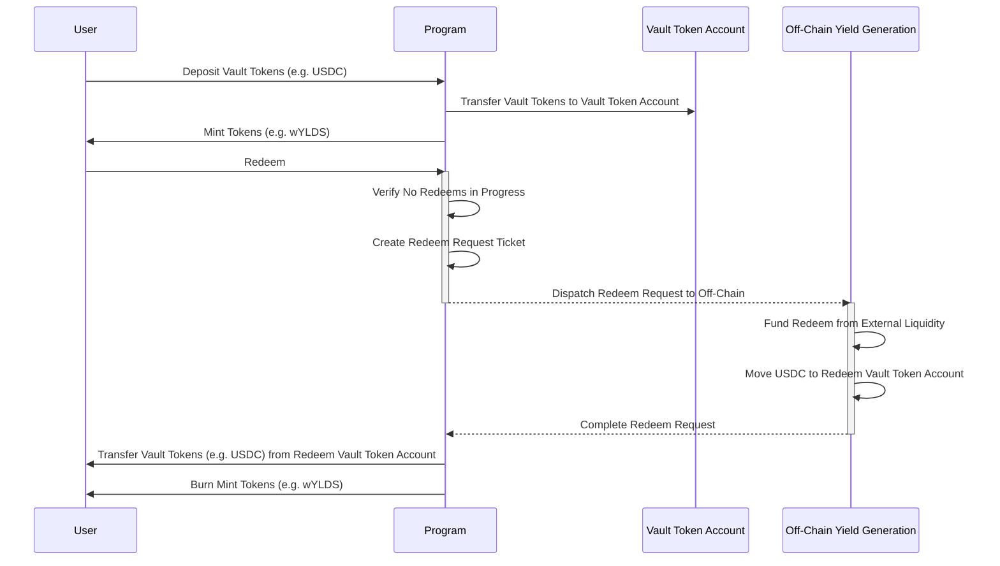
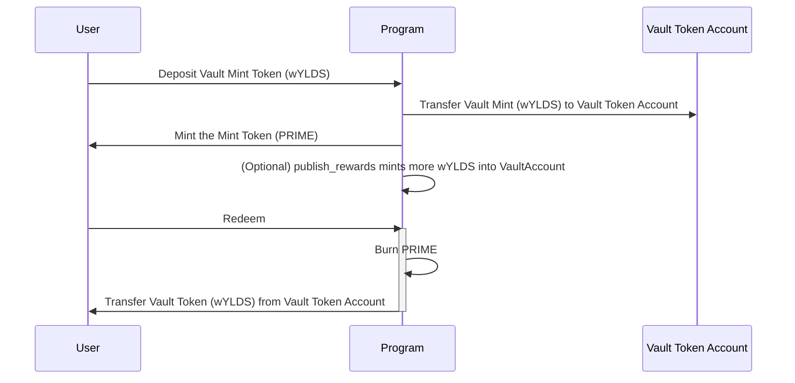

# Hastra Vault Protocol on Solana

The Hastra Vault workspace ships **three** Anchor programs:


| Program              | Crate              | Role                                                                                             |
| -------------------- | ------------------ | ------------------------------------------------------------------------------------------------ |
| **vault-mint**       | `vault_mint`       | USDC → wYLDS (1:1) mint/redeem, merkle reward epochs, `external_program_mint` for staking pools  |
| **vault-stake**      | `vault_stake`      | **PRIME** pool: deposit wYLDS, mint PRIME, redeem with Chainlink-backed price, `publish_rewards` |
| **vault-stake-auto** | `vault_stake_auto` | **AUTO** pool: same mechanics as PRIME under a separate program id and PDAs                      |


Users swap vault tokens (e.g. USDC) for receipt tokens (wYLDS) through **vault-mint**. They stake wYLDS into **vault-stake** (PRIME) or **vault-stake-auto** (AUTO); rewards are minted into the pool via `publish_rewards`, which CPIs **vault-mint** so backing per share increases over time.

## Core Architecture

**Deposit Mechanism:**

- Users deposit vault tokens (e.g. USDC) into a program-controlled vault
- Program mints equivalent mint tokens (e.g. wYLDS) that maintain 1:1 parity
- Users can trade/transfer mint tokens freely

The **rewards process** in this Solana vault protocol involves off-chain yield generation and on-chain distribution via merkle trees and proofs.

## Off-Chain Yield Generation Process

**Yield Generation Flow:**

1. Vault tokens (e.g. USDC) deposited by users sits in the program-controlled vault
2. Authorized business entities use vault tokens for external investment
3. Vault tokens deployed into high-yield DeFi protocols, lending markets, or other investment vehicles
4. Yield generated from these external positions accumulates off-chain
5. Business process calculates each user's pro-rata share based on their mint token holdings and duration

## On-Chain Rewards Distribution

Rewards are distributed on-chain using a merkle tree-based claim system to ensure efficiency and security. The program is initialized with a list of reward administrators who can post new reward epochs. Each reward epoch contains a merkle root summarizing user rewards for that period.

**Epoch-Based System:**

- Rewards are distributed in discrete epochs (e.g., weekly)
- Each epoch has a unique index and merkle root representing user rewards
- Epoch duration and timing are configurable by program administrators
- Users can only claim rewards for past epochs, not the current one
- Epochs are immutable once created to ensure integrity
- Administrators can create epochs with a merkle root summarizing user rewards
- Users claim rewards by providing a merkle proof against the stored root
- Rewards are minted as additional mint tokens (e.g. wYLDS)

**Merkle Tree Structure:**

- **Leaf Node**: `sha256(user_pubkey || reward_amount_le_bytes || epoch_index_le_bytes)`
- **Tree Construction**: All user rewards for an epoch are hashed and organized into a sorted binary merkle tree
- **Root**: Final merkle root represents the entire reward distribution for that epoch

**Administrative Posting Process:**

1. Authorized reward admin computes user rewards off-chain
2. Constructs merkle tree and computes root
3. Calls `create_rewards_epoch()` with epoch index, merkle root, and total rewards:

```rust
pub fn create_rewards_epoch(
    ctx: Context<CreateRewardsEpoch>,
    index: u64,           // Epoch identifier
    merkle_root: [u8; 32], // Computed merkle root
    total: u64,           // Total rewards for verification
) -> Result<()>
```

## User Claim Process

Users claim their rewards by providing their allocated amount and a merkle proof. The program verifies the proof against the stored merkle root for the specified epoch.

**Merkle Proof Verification:**

1. User provides their allocated `amount` and merkle `proof` (array of sibling hashes)
2. Program reconstructs leaf: `sha256(user || amount || epoch_index)`
3. Program walks up the tree using proof siblings with sorted pair hashing
4. Final computed root must match the stored epoch merkle root

```rust
pub fn claim_rewards(
    ctx: Context<ClaimRewards>,
    amount: u64,
    proof: Vec<[u8; 32]>
) -> Result<()>
```

## Double-Claim Prevention

**Claim Record System:**

- Each successful claim creates a `ClaimRecord` PDA with seeds: `[b"claim", epoch.key(), user.key()]`
- Account creation constraint prevents duplicate claims:
  ```rust
  #[account(
      init,  // Fails if account already exists
      payer = user,
      space = ClaimRecord::LEN,
      seeds = [b"claim", epoch.key().as_ref(), user.key().as_ref()],
      bump
  )]
  pub claim_record: Account<'info, ClaimRecord>,
  ```

**Security Benefits:**

- **Immutable Claims**: Once created, ClaimRecord cannot be deleted or modified
- **Epoch Isolation**: Each epoch has separate claim records, preventing cross-epoch issues
- **User Isolation**: Each user has individual claim records per epoch
- **Rent Recovery**: Claim records are permanent (no close instruction), ensuring claim history preservation

This design ensures that yield generated from vault tokens is fairly distributed to mint token holders while preventing any possibility of double-claiming rewards.

## Staking Rewards

The staking programs (`vault-stake` for PRIME and `vault-stake-auto` for AUTO) allow users to deposit wYLDS and mint share tokens. Rewards increase the value backing each share token by minting additional wYLDS into the pool vault.

Staking rewards are published via `publish_rewards`, which CPIs into **vault-mint** (`external_program_mint`) to mint additional wYLDS into the pool vault. The mint program must authorize the caller: **PRIME** uses the legacy `allowed_external_mint_program` on `Config`; **AUTO** is registered on the `**AllowedExternalMintPrograms`** PDA (`register_allowed_external_mint_program`). The allow-list registration cap is managed separately via `update_external_mint_programs_limit` (script: `scripts/vault-mint/update_external_mint_programs_limit.ts`, range `0..=255`; `0` disables new registrations). Users realize rewards when they redeem: the stake program burns PRIME or AUTO and transfers wYLDS per the oracle price.

### Reward publication limits (`StakeRewardConfig`)

`publish_rewards` is constrained by on-chain fields stored in the `StakeRewardConfig` PDA:

1. **Relative cap (`max_reward_bps`)**: limits reward amount relative to local pool TVL (default 75 BPS = 0.75%).
2. **Absolute per-call cap (`max_period_rewards`)**: default `1,000,000` wYLDS (6-decimal raw units: `1_000_000_000_000`).
3. **Cooldown (`reward_period_seconds`)**: default `3540` seconds (59 minutes).
4. **Lifetime cap (`max_total_rewards`)**: default `10,000,000` wYLDS (6-decimal raw units: `10_000_000_000_000`).

The guard state is stored at PDA:

`[b"stake_reward_config", stake_config.key()]`

#### Migrating `StakeRewardConfig` In-Place (Realloc)

When the `StakeRewardConfig` account layout grows, migration is performed in-place on the same PDA (`[b"stake_reward_config", stake_config.key()]`) under upgrade-authority controls:

- **vault-stake (PRIME):** use `migrate_reward_config` (migration-only path).
- **vault-stake-auto (AUTO):** use `migrate_reward_config` (migration-only path).

After migration, cap updates (`update_max_period_rewards`, `update_reward_period_seconds`, `update_max_total_rewards`, `update_max_reward_bps`) use fixed account sizes and do not require additional migration-specific accounts.

For existing deployments, newly added fields are also lazily defaulted on first use (for example during `publish_rewards`, which uses `init_if_needed` for the account) so older layouts keep working after upgrade.

`migrate_reward_config` is an upgrade-authority-only migration instruction on both stake programs. It always writes `max_reward_bps` from arguments. The other three arguments (`max_period_rewards`, `reward_period_seconds`, `max_total_rewards`) are written only when the stored value is still zero (migration-style). To change caps or cooldown after those fields are non-zero, use `update_max_period_rewards`, `update_reward_period_seconds`, or `update_max_total_rewards`.

Scripts:


| Path                                                              | When to use                                                                                                             |
| ----------------------------------------------------------------- | ----------------------------------------------------------------------------------------------------------------------- |
| `scripts/vault-stake/migrate_reward_config.ts`                    | Direct migration path; use default program id for PRIME, or pass `--program_id <VAULT_STAKE_AUTO_PROGRAM_ID>` for AUTO. |
| `scripts/vault-stake/migrate_reward_config_proposal_squads_v3.ts` | Squads v3 proposal helper; pass the target program id (PRIME or AUTO) via script inputs.                                |


Example (local wallet is upgrade authority, set multiple fields in one run):

```bash
ANCHOR_PROVIDER_URL=http://127.0.0.1:8899 ANCHOR_WALLET=~/.config/solana/id.json \
  yarn ts-node scripts/vault-stake/migrate_reward_config.ts \
    --max_reward_bps 120 \
    --reward_period_seconds 3600
```

Example (Squads v3 proposal with multiple updates):

```bash
ANCHOR_PROVIDER_URL=https://api.devnet.solana.com ANCHOR_WALLET=~/.config/solana/squad-member.json \
  yarn ts-node scripts/vault-stake/migrate_reward_config_proposal_squads_v3.ts \
    --multisig_pda <SQUADS_V3_MULTISIG_PDA> \
    --program_id <VAULT_STAKE_OR_AUTO_PROGRAM_ID> \
    --max_reward_bps 90 \
    --max_period_rewards 1000000000000
```

## Staking Program Price Oracle

Both **vault-stake** (PRIME) and **vault-stake-auto** (AUTO) use a [Chainlink Data Streams](https://docs.chain.link/data-streams) price feed for the share token vs wYLDS rate at deposit and redeem time. This replaces a pure vault-balance ratio with an externally verified price, decoupling the rate from pool balance movements (such as reward distributions).

### Price Convention

The stored price represents **wYLDS per 1 share** (PRIME or AUTO), scaled by `price_scale`:

```
price = (wYLDS per 1 PRIME) × price_scale
```


| Operation                | Formula                                                                        |
| ------------------------ | ------------------------------------------------------------------------------ |
| Deposit (wYLDS → shares) | `shares_minted = wYLDS_deposited × price_scale / price`                        |
| Redeem (shares → wYLDS)  | `wYLDS_returned = shares_burned × price / price_scale`                         |
| Exchange rate view       | `rate = price × 1_000_000_000 / price_scale` (assets per share, scaled by 1e9) |


### `StakePriceConfig` Account

Price configuration lives in a dedicated PDA with seeds `[b"stake_price_config", stake_config.key()]`, keeping the existing `StakeConfig` account layout unchanged.


| Field                         | Type       | Description                                                                                |
| ----------------------------- | ---------- | ------------------------------------------------------------------------------------------ |
| `chainlink_program`           | `Pubkey`   | Chainlink verifier program ID                                                              |
| `chainlink_verifier_account`  | `Pubkey`   | Verifier state account                                                                     |
| `chainlink_access_controller` | `Pubkey`   | Access controller account                                                                  |
| `feed_id`                     | `[u8; 32]` | Expected feed ID, validated on each `verify_price` call                                    |
| `price`                       | `i128`     | Last verified benchmark price                                                              |
| `price_scale`                 | `u64`      | Scale factor matching Chainlink feed precision (e.g. `1_000_000_000_000_000_000` for 1e18) |
| `price_timestamp`             | `i64`      | Report `observations_timestamp` from the last successful `verify_price` (staleness anchor; `0` = not set) |
| `price_max_staleness`         | `i64`      | Maximum age of stored price in seconds before deposit/redeem reject it                     |
| `bump`                        | `u8`       | PDA bump                                                                                   |


### Price Instructions


| Instruction               | Authority                 | Description                                                                                                                      |
| ------------------------- | ------------------------- | -------------------------------------------------------------------------------------------------------------------------------- |
| `initialize_price_config` | Program upgrade authority | Creates the `StakePriceConfig` PDA. Must be called once after each program deployment before any deposit or redeem.              |
| `update_price_config`     | Program upgrade authority | Updates Chainlink addresses, feed ID, price scale, or staleness without resetting the stored price.                              |
| `verify_price`            | Rewards administrators    | Submits a signed Chainlink report for on-chain verification via CPI. On success, stores the verified price and the report’s `observations_timestamp` (staleness anchor). |
| `set_price_for_testing`   | Program upgrade authority | Directly sets `price` and `price_timestamp`. For localnet testing only — not for production use.                                 |


The same instruction set exists on **vault-stake-auto** (AUTO). Operational tooling is unified under `scripts/vault-stake/`; target AUTO by passing `--program_id <VAULT_STAKE_AUTO_PROGRAM_ID>` where supported.

### Staleness Protection

Both `deposit` and `redeem` reject a stored price that is too old:

- `price_timestamp == 0` → `PriceNotInitialized` (oracle not yet seeded)
- `current_time − price_timestamp > price_max_staleness` → `PriceTooStale`

`price_timestamp` is the Chainlink report’s **observations** time (set in `verify_price`), not the wall-clock time of the verify transaction, so age is measured from the oracle’s vouched validity window end.

The oracle check runs **before** the user balance check in `redeem`, so a stale oracle fails fast regardless of user balance.

### Mint Program Token and Token Accounts

The program requires two tokens and one token account to operate. The tokens can be any SPL token, but typically the vault token is a stablecoin like USDC, and the mint token is a custom token that represents a claim on the vault tokens. There are token accounts for both the user and the program to hold the tokens.

To make it easier to understand the tokens in play, here's a sequence diagram on how the tokens interact.


```mermaid
sequenceDiagram
    participant User
    participant Program
    participant VaultAccount as Vault Token Account
    participant Offchain as Off-Chain Yield Generation

    User->>Program: Deposit Vault Tokens (e.g. USDC)
    Program->>VaultAccount: Transfer Vault Tokens to Vault Token Account
    Program->>User: Mint Tokens (e.g. wYLDS)
    User->>Program: Redeem
    activate Program
    Program->>Program: Verify No Redeems in Progress
    Program->>Program: Create Redeem Request Ticket
    Program-->>Offchain: Dispatch Redeem Request to Off-Chain
    deactivate Program
    activate Offchain
    Offchain->>Offchain: Fund Redeem from External Liquidity
    Offchain->>Offchain: Move USDC to Redeem Vault Token Account
    Offchain-->>Program: Complete Redeem Request
    deactivate Offchain
    Program->>User: Transfer Vault Tokens (e.g. USDC) from Redeem Vault Token Account
    Program->>User: Burn Mint Tokens (e.g. wYLDS)
```


### Mint Program Accounts in Play


| Token/Account Type   | Symbol     | Description                                                                                                                                                                                                                                       | Mint Authority                                                                                                      | Freeze Authority                                                                |
| -------------------- | ---------- | ------------------------------------------------------------------------------------------------------------------------------------------------------------------------------------------------------------------------------------------------- | ------------------------------------------------------------------------------------------------------------------- | ------------------------------------------------------------------------------- |
| Vault Token          | e.g. USDC  | The token the user deposits to receive the minted token                                                                                                                                                                                           | External vault token mint authority                                                                                 | External vault token freeze authority                                           |
| Mint Token           | e.g. wYLDS | The token that is minted when the user deposits vault tokens                                                                                                                                                                                      | Your Solana Wallet initially, then Program Derived Address (PDA) of the program                                     | Your Solana Wallet initially, then Program Derived Address (PDA) of the program |
| Vault Token Account  | N/A        | The token account that will hold the vaulted tokens when users deposit them in exchange for mint tokens                                                                                                                                           | This token account authority is not the program, so the holder can deploy vaulted tokens for off-chain investments. | N/A                                                                             |
| Redeem Token Account | N/A        | The token account that will hold vaulted tokens (USDC) when users request a redeem. Once the off-chain entity approves the redeem this account is funded and the program transfers the vault to the user on authority of a rewards administrator. | N/A                                                                                                                 | N/A                                                                             |


### Staking Program Token and Token Accounts

The program requires two tokens to operate. The tokens can be any SPL token, but typically the vault token is a stablecoin like wYLDS, and the mint token is a custom token that represents a claim on the vault tokens. There are token accounts for both the user and the program to hold the tokens.

To make it easier to understand the tokens in play, here's a sequence diagram on how the tokens interact.


```mermaid
sequenceDiagram
    participant User
    participant Program
    participant VaultAccount as Vault Token Account
    
    User->>Program: Deposit Vault Mint Token (wYLDS)
    Program->>VaultAccount: Transfer Vault Mint (wYLDS) to Vault Token Account
    Program->>User: Mint the Mint Token (PRIME)
    Program->>Program: (Optional) publish_rewards mints more wYLDS into VaultAccount
    User->>Program: Redeem
    activate Program
    Program->>Program: Burn PRIME
    Program->>User: Transfer Vault Token (wYLDS) from Vault Token Account
    deactivate Program
```


### Staking Program Accounts in Play


| Token/Account Type  | Symbol | Description                                                                                                                             | Mint Authority                                                                                               | Freeze Authority                                                                                             |
| ------------------- | ------ | --------------------------------------------------------------------------------------------------------------------------------------- | ------------------------------------------------------------------------------------------------------------ | ------------------------------------------------------------------------------------------------------------ |
| Vault Mint          | wYLDS  | The token the user deposits to receive the minted token (PRIME)                                                                         | Your Solana Wallet (e.g. hastra-devnet-id.json) initially, then Program Derived Address (PDA) of the program | Your Solana Wallet (e.g. hastra-devnet-id.json) initially, then Program Derived Address (PDA) of the program |
| Mint Token          | PRIME  | The token that is minted when the user deposits the vault token (wYLDS)                                                                 | Your Solana Wallet (e.g. hastra-devnet-id.json) initially, then Program Derived Address (PDA) of the program | Your Solana Wallet (e.g. hastra-devnet-id.json) initially, then Program Derived Address (PDA) of the program |
| Vault Token Account | N/A    | The token account that will hold the vaulted tokens (e.g. wYLDS) when users deposit them in exchange for the minted token (e.g. PRIME). | Program Derived Address (PDA) of the program                                                                 | N/A                                                                                                          |


## Administrative Features

**Freeze System:**

- Designated administrators can freeze/thaw specific token accounts
- Useful for compliance, security incidents, or regulatory requirements
- Maximum 5 freeze administrators with program update authority control

**Rewards Distribution:**

- Merkle tree-based reward claims for mint token holder incentives
- Epoch-based system with configurable reward periods
- Prevents double-claiming with permanent claim records
- Rewards minted as additional mint tokens (e.g. wYLDS)

## Security Model

**Program-Controlled Assets:**

- Vault authority PDA controls all deposited vault tokens
- Mint authority PDA controls mint token issuance
- Freeze authority PDA manages account freezing capabilities

**Administrative Controls:**

- Program upgrade authority can modify configurations
- Separate administrator lists for freeze and rewards functions
- All sensitive operations require proper authority validation

**Account Structure:**

- `Config`: Program settings and administrator lists
- `RewardsEpoch`: Manages reward distribution with merkle proofs
- `ClaimRecord`: Prevents reward double-spending

**Protocol pause (vault-mint and each stake program)**  

- **vault-mint** `pause` stops user-facing mint instructions (including CPIs such as `external_program_mint` used by `publish_rewards`).  
- **vault-stake** / **vault-stake-auto** `pause` stops deposit, redeem, and other guarded instructions for that pool.  
- Merkle **claim_rewards** in vault-mint respects the mint program pause flag.

This creates a secure, flexible vault protocol suitable for DeFi protocols requiring both liquidity and governance controls.

There are several different aspects to this repo, but all are related to the Vault/Mint program. We use rust (for the solana program), typescript (helpers that use the solana and anchor libs), and resource files (configurations, images, etc... that assist in setting everything up).

## Project Layout

### Core Components

**Rust Programs** (`programs/vault-mint`, `programs/vault-stake`, `programs/vault-stake-auto`; sources under `src/`):

- **State Management**: Account structures and program data models
- **Business Logic**: Deposit, withdrawal, rewards, and administrative functions
- **Security Layer**: Authorization guards and error handling

**TypeScript Scripts** (`scripts/*/`):

- **Deployment Tools**: Automated setup and configuration management
- **User Operations**: Deposit, redeem, and claim workflows
- **Admin Functions**: Program updates and authority management

**Generated Assets** (`target/`):

- **Program Binary**: Deployable Solana bytecode
- **Type Definitions**: TypeScript interfaces for client integration
- **IDL Files**: JSON schema for cross-platform compatibility

This modular structure separates on-chain program logic from off-chain tooling while providing comprehensive deployment and management capabilities.

## Required Libs/Utils

Like all recent projects, we have to include a bunch of boiler plate libs/utils. We'll keep a running list here, but it is best to note that this project got started by reading the [https://solana.com/docs/intro/installation](https://solana.com/docs/intro/installation) doc.

**Prerequisites**

- yarn
- solana w/spl-token
- anchor cli **0.31.x** (see `[toolchain]` in `Anchor.toml`; recommend `avm` to match the workspace version)
- rust

### Yarn

`yarn install` to install node js dependencies. Don't make the mistake I did, and try to use npm.

### Anchor

To build the project with anchor, we have to install rust. It is also best to ensure you have the latest version by running `rustup update` prior to engaging in development. Anchor follows the conventional command for building the Solana programs in this repo.

```bash
$ anchor build
```

## Build and Release

The deployment workflow is split into two interactive scripts that share a common configuration layer:


| Script                    | Purpose                                                                                                                                                                                    |
| ------------------------- | ------------------------------------------------------------------------------------------------------------------------------------------------------------------------------------------ |
| `scripts/setup-tokens.sh` | **Part 1** — Create SPL tokens, token accounts, and Metaplex metadata. This step is needed **only for new installations.** For ongoing maintenance, only the `deploy.sh` script is needed. |
| `scripts/deploy.sh`       | **Part 2** — Build programs, write upgrade buffers for Squads, initialize programs, set authorities                                                                                        |


> Programs are **never deployed directly** from `deploy.sh`. Instead, the script writes a program buffer on-chain and prints the buffer address and SHA-256 hash so you can create a Squads upgrade proposal. This ensures every deployment goes through the M-of-N multisig approval process. See [Creating a Squads Upgrade Request](#creating-a-squads-upgrade-request) below.

Both scripts persist selections to a network-specific history file (e.g. `devnet_vault.history`) so you don't have to re-enter values on every run.

## Initial Setup

### Generate a new keypair

This section assumes a fresh rollout on devnet. If you already have a keypair you want to use, skip this step.

```bash
$ solana-keygen new --no-passphrase --force --outfile ~/.config/solana/hastra-devnet-id.json
Generating a new keypair
Wrote new keypair to /Users/jd/.config/solana/hastra-devnet-id.json
================================================================================
pubkey: GusaXhaH11VvYyFvsEiaaaBw3oFUjgmVoJZswzb9cnqc
================================================================================
Save this seed phrase to recover your new keypair:
refuse detail throw curtain spell journey grab shiver assume salute recycle tube
================================================================================
```

---

## Part 1 — Token Setup (`scripts/setup-tokens.sh`)

Run this script once when setting up a new deployment environment. It creates the SPL tokens and token accounts that the programs require, and registers their metadata on Metaplex.

> This step is **only needed for new installations** and **not for ongoing maintenance**.

### Start `setup-tokens.sh`

```
$ cd scripts && sh setup-tokens.sh

Select Solana network (localnet, devnet, mainnet-beta, testnet) []: devnet
Solana Keypair from config: /Users/jd/.config/solana/hastra-devnet-prime.json
Solana RPC URL from config: https://api.devnet.solana.com
Enter path to Solana wallet keypair [/Users/jd/.config/solana/hastra-devnet-prime.json]:
Enter Solana RPC URL [https://api.devnet.solana.com]:

Config File: /Users/jd/.config/solana/cli/config.yml
RPC URL: https://api.devnet.solana.com
WebSocket URL: wss://api.devnet.solana.com/ (computed)
Keypair Path: /Users/jd/.config/solana/hastra-devnet-prime.json
Commitment: confirmed

Public Key:             HT9c4xkDT9bx2JyMfLrauNmg8BA7bjUm7qba1vdMsMrz (8.34021568 SOL)
Vault Mint Program ID:  9WUyNREiPDMgwMh5Gt81Fd3JpiCKxpjZ5Dpq9Bo1RhMV
Vault Stake Program ID: 97V7JsExNC6yFWu5KjK1FLfVkNVvtMpAFL5QkLWKEGxY
Mint Token (wYLDS):     <not set>
Vault Token (USDC):     <not set>
Staking Token (PRIME):  <not set>

Select an action:
1) Create Mint Token (wYLDS)
2) Create Stake Token (PRIME)
3) Create Mint Program Redeem Vault Token Account
4) Create Stake Program Vault Token Account
5) Setup Metaplex Metadata
6) Show Accounts & PDAs
7) Exit
#?
```

### Option `1` — Create Mint Token (wYLDS)

Creates the SPL token that is minted when users deposit vault tokens (e.g. USDC). The mint authority is initially your wallet; it is transferred to a program PDA after initialization.

```
Creating Mint Program mint token...
Mint Program mint token: 2vEiPvsJjpctLv78HACy9uQB4nm88oX8fbbfW7MaWiaB
```

### Option `3` — Create Mint Program Redeem Vault Token Account

Creates the token account that holds vault tokens (USDC) during the redeem process. After initialization the redeem vault authority PDA controls this account.

```
Creating Mint Program redeem vault ATA...
Mint Program redeem vault ATA: 717cmnRqL1mRYRWVqFjrNKDHtQS3neLPuAbJBZaa5ah1
```

### Option `2` — Create Stake Token (PRIME)

Creates the SPL token minted when users deposit the mint token (wYLDS) into the staking program. The mint authority is transferred to a program PDA after initialization.

```
Creating Stake Program mint token...
Stake Program mint token: 6vTKjkQ5srGZPyfjKf3nRa97Lf9hQn6Yx7Gs6SB8y7Ht
```

### Option `4` — Create Stake Program Vault Token Account

Creates the token account that holds staked wYLDS. This is the supply pool for staked mint tokens; its authority is set to a program PDA after initialization.

```
Creating Stake Program vault token ATA...
Stake Program vault token ATA: 94DMQyHTpyvGvGpjmukrRAxXwEhZfmiKyoSu12seHFYz
```

### Option `5` — Setup Metaplex Metadata

Registers on-chain metadata (name, symbol, image URL) for both the mint and stake tokens. You are prompted for each token in sequence.

```
Enter Mint Token Metaplex Token Name []: wYLDSdev
Enter Mint Token Metaplex Token Symbol []: wYLDSdev
Enter Mint Token Metaplex Token Metadata URL (must be a valid JSON URL) []: https://storage.googleapis.com/hastra-cdn-prod/spl/wyldsdevnet.meta.json
...
Enter Stake Token Metaplex Token Name []: PRIMEdev
Enter Stake Token Metaplex Token Symbol []: PRIMEdev
Enter Stake Token Metaplex Token Metadata URL (must be a valid JSON URL) []: https://storage.googleapis.com/hastra-cdn-prod/spl/primedevnet.meta.json
✨  Done in 15.96s.
```

### Option `6` — Show Accounts & PDAs

Prints all program IDs, token addresses, token accounts, and derived PDAs in one view. Useful for confirming state before moving to Part 2.

---

## Part 2 — Build & Deploy (`scripts/deploy.sh`)

Run this script to build programs, write upgrade buffers for Squads, and initialize programs after the first Squads-executed deployment.

> Refer to the Squads section of the [Squads Docs](https://docs.squads.so/docs/getting-started/deploying-programs) for more details on the upgrade process.

> This section assumes that you have already set up a Squads vault (either on devnet or mainnet) and have the Squads vault address in your wallet. See [GitHub Release](#github-release) below.

> After Chainlink pricing is enabled on a stake program, complete `initialize_price_config` and `verify_price` before users can deposit or redeem. See [Chain Link Pricing Specific Post-Upgrade Initialization](#chain-link-pricing-specific-post-upgrade-initialization).

### Start `deploy.sh`

```
$ cd scripts && sh deploy.sh

Select Solana network (localnet, devnet, mainnet-beta, testnet) []: devnet
...

Public Key:             HT9c4xkDT9bx2JyMfLrauNmg8BA7bjUm7qba1vdMsMrz (8.34021568 SOL)
Vault Mint Program ID:  9WUyNREiPDMgwMh5Gt81Fd3JpiCKxpjZ5Dpq9Bo1RhMV
Vault Stake Program ID: 97V7JsExNC6yFWu5KjK1FLfVkNVvtMpAFL5QkLWKEGxY
Squads Vault:           ATAkatkGWPDNdhLmeqd1PPdG6h7af5kkmivisuqVvX3K
Mint Buffer:            <none>
Stake Buffer:           <none>

The menu includes separate steps for **vault-mint**, **vault-stake** (PRIME), and **vault-stake-auto** (AUTO): build, write buffers, initialize, and set mint/freeze authorities. Exact option numbers may change—use the script’s live prompt.

Example (abbreviated):

```

Select an action:

1. Build Programs
2. Write Vault Mint Buffer (for Squads upgrade)
3. Write Vault Stake Buffer (for Squads upgrade)
4. Write Vault Stake Auto Buffer (for Squads upgrade)
5. Write All Buffers

```

### Option `9` — Configure Squads Vault Address

Set the Squads vault PDA once so subsequent buffer writes can optionally transfer buffer authority automatically.

```

Enter Squads vault address (used as upgrade authority) []: ATAkatkGWPDNdhLmeqd1PPdG6h7af5kkmivisuqVvX3K

```

This value is persisted to the network history file.

### Option `1` — Build Programs

Runs `anchor build` and prompts for the destination paths to copy the generated IDL and TypeScript types to the frontend project (e.g. `hastra-fi-nexus-flow`).

```

...snip...
    Finished `release` profile target(s) in 95.12s

Enter destination for vault_mint.ts TYPE [../../hastra-fi-nexus-flow/src/types/vault-mint.ts]:
Enter destination for vault_mint.ts IDL  [../../hastra-fi-nexus-flow/src/types/idl/vault-mint.ts]:
Copied to ../../hastra-fi-nexus-flow/src/types/vault-mint.ts
Copied to ../../hastra-fi-nexus-flow/src/types/idl/vault-mint.ts

Enter destination for vault_stake.ts TYPE [../../hastra-fi-nexus-flow/src/types/vault-stake.ts]:
Enter destination for vault_stake.ts IDL  [../../hastra-fi-nexus-flow/src/types/idl/vault-stake.ts]:
Copied to ../../hastra-fi-nexus-flow/src/types/vault-stake.ts
Copied to ../../hastra-fi-nexus-flow/src/types/idl/vault-stake.ts

```

### Option `2` / `3` / `4` — Write Program Buffer(s)

Writes the compiled `.so` to an on-chain buffer account, prints the buffer address and SHA-256 hash, and optionally transfers buffer authority to the configured Squads vault. Use this instead of `solana program deploy`.

```

Writing Vault Mint Program to buffer...
Program file: ../target/deploy/vault_mint.so
SHA-256: a3f2c1d4e5b6789012345678abcdef01234567890abcdef1234567890abcdef12

# ============================================================

  Vault Mint Program Buffer Written

# Buffer Address : 5tWAz76wZXCB3GFzpdswa7E9ZkVP6R9KrsmBZ9sV3fQX

  SHA-256        : a3f2c1d4e5b6789012345678abcdef01234567890abcdef1234567890abcdef12

Next steps:

1. Verify the SHA-256 above matches the GitHub release artifact.
2. Go to devnet.squads.so (or squads.so for mainnet).
3. Create a Program Upgrade proposal using:
  Buffer Address : 5tWAz76wZXCB3GFzpdswa7E9ZkVP6R9KrsmBZ9sV3fQX
  Program ID     : 9WUyNREiPDMgwMh5Gt81Fd3JpiCKxpjZ5Dpq9Bo1RhMV
  Buffer Refund  : your wallet address

Transfer buffer authority to Squads vault now? [y/N]: y
Buffer authority transferred to ATAkatkGWPDNdhLmeqd1PPdG6h7af5kkmivisuqVvX3K

```

> The SHA-256 printed here must match the hash in the GitHub release artifact. See [GitHub Release](#github-release) below.

### Option `5` — Initialize Mint Program

Run this **after** Squads executes the first deployment. Sets up the config account, PDAs, freeze/rewards administrators, and the allowed caller program ID.

```

Enter comma-separated list of Freeze Administrator addresses []: GrzQ4vW3UviEDKN7aHGroayoJC3B87ovcSofyt2Q48KG,56NYkGD9TCijuYgfeiHTbMN9sqcr9uH2CeV1GnSCy4Xn
Enter comma-separated list of Rewards Administrator addresses []: GrzQ4vW3UviEDKN7aHGroayoJC3B87ovcSofyt2Q48KG,56NYkGD9TCijuYgfeiHTbMN9sqcr9uH2CeV1GnSCy4Xn
Program ID: 9WUyNREiPDMgwMh5Gt81Fd3JpiCKxpjZ5Dpq9Bo1RhMV
Vault (accepted token): 4zMMC9srt5Ri5X14GAgXhaHii3GnPAEERYPJgZJDncDU
Mint (token to be minted): EcqKZtgqAdtxjACxinNUrKUXJVuVARwc1YCFNQUGPz6
Config PDA: BY7kJQ7H41DbzZZtZaoWh5eYYQx1RXqAur6B3BM1P6ef
Mint Authority PDA: BxW9j6D5UCdMCAwGXYBmuvGZZw8oiMoLkZT29rpMrzp2
Freeze Authority PDA: 4cpL9meEt6hPuG2SBbDr4jUxXDtaGTVqm7pxzdTd8iZV
Transaction: 3fU2zPujqqjfXD4bG2hjxSEFvvpYQMzZFRAvBkbt8tzce3H6q8NXXW6FBtJYmDQgFLGCLWHYxU4eJCqenBpqyzJF
Done in 3.10s.

```

### Option `6` — Initialize Stake Program

Run this after the stake program's first Squads-executed deployment. Configures administrators and the core stake PDAs.

> **After initialization**, also call `initialize_price_config` (via a Squads transaction proposal, since the upgrade authority is the Squads vault PDA) and then `verify_price` (directly by a rewards administrator) with a fresh Chainlink-signed report before any user deposit or redeem can succeed. See [Post-Upgrade Initialization](#post-upgrade-initialization) above.

```

Program ID: 97V7JsExNC6yFWu5KjK1FLfVkNVvtMpAFL5QkLWKEGxY
Vault (accepted token): EcqKZtgqAdtxjACxinNUrKUXJVuVARwc1YCFNQUGPz6
Mint (token to be minted): 6vTKjkQ5srGZPyfjKf3nRa97Lf9hQn6Yx7Gs6SB8y7Ht
Config PDA: Bdjt3yVjegtwfXH4qzSUCMvT1avMfzKzrUXf4ZV8jVR2
Vault Authority PDA: fByzStfcJmRWnmk7ySxcW7JyPLhzVnQawVtwnknrHRg
Transaction: 3SJbVXBpGRCSboKRy5mWAV9Qpdc7nmJYCfTdrQRxG6i14f5MV7pGKuaySH65UYa615zrgV3EKYSseL59eenfVjGZ
Done in 3.09s.

```

### Option `7` — Set Mint Program Mint and Freeze Authorities

Transfers the mint and freeze authority of the wYLDS token to the program PDAs. Run once after initialization so that only the on-chain program can mint or freeze.

```

Setting Mint Program mint authority to BxW9j6D5UCdMCAwGXYBmuvGZZw8oiMoLkZT29rpMrzp2
Signature: JLWN8kuypcM8gEAvnvQBQvKPsLFP8URec97dJMYes8myHt3qvCtYZMMNVbaDBSYaXnxY2K32gwmmEmrfeirqYAm

Setting Mint Program freeze authority to 4cpL9meEt6hPuG2SBbDr4jUxXDtaGTVqm7pxzdTd8iZV
Signature: q8ckEeRm6GcWJbCfEV3DTW4hVDiarbxM1rV8HdWqyVojVeQ7b9A2HoBcjgT7ZsY2djfeNVEgyNyKBTuEg6yJ6SU

```

### Option `8` — Set Stake Program Mint and Freeze Authorities

Transfers the mint and freeze authority of the PRIME token to the stake program PDAs.

```

Setting Stake Program mint authority to HyKvZbsURg9gd2zkfzjdLkGYhV7uLymzfwkbwa1kWhwa
Signature: 3ME5sE2EJT41GjmUWrSZsE6tspdDd7x7GjrzPTZ5WaD62shJSGSLLMv9gEYPzq6YCcRHMEgH9xmx2Ks6rqTiG4kw

Setting Freeze Authority to DMqBGKYzHDLbmj3XgjDHoQNghTASiyAdwH7UqY985Pib
Signature: Nchp5Tdd5L8gPu1xheqTAjHP9LoaZYjwQw2D8D5dE89eVna8Rqrp18KvmtCTvfy5ZwRmaxbHzaxYDRgxw8xr1oa

```

## Freeze and Thaw

The program uses a list of accounts that define the freeze and thaw administrators. These accounts can freeze and thaw user token accounts for mint tokens. This is useful in the event of a security issue or other situation where you need to prevent users from transferring their mint tokens.

> Mint tokens must be created with the `--enable-freeze` flag to allow freezing and thawing of accounts. Mint tokens must also have a freeze authority set to the PDA of the program. `config.sh` script has a helper function to set the mint and freeze authority to the PDA of the program that can be run after the program is deployed and initialized.

### Add Freeze/Thaw Admin(s)

Use a comma to separate multiple admin public keys. Up to 5 are allowed.

```bash
$ ANCHOR_PROVIDER_URL=https://api.devnet.solana.com \
    ANCHOR_WALLET=~/.config/solana/hastra-devnet-id.json
    yarn run ts-node scripts/vault-mint/add_freeze_thaw_admin.ts \
    --admin <FREEZE_THAW_ADMIN_PUBLIC_KEY> \
    --mint AVpS6aTBQyCFBA4jymYRWqDyL7ipurn24PZVdjbbWT3X
```

### Freeze a User Account

Put a freeze on an account's mint token account. This prevents the user from transferring their mint tokens.

```bash
$ ANCHOR_PROVIDER_URL=https://api.devnet.solana.com \
    ANCHOR_WALLET=~/.config/solana/hastra-devnet-id.json
    yarn run ts-node scripts/vault-mint/freeze_account.ts \
    --user_account <USER_MINT_TOKEN_ACCOUNT_TO_FREEZE> \
    --mint AVpS6aTBQyCFBA4jymYRWqDyL7ipurn24PZVdjbbWT3X
```

### Thaw a User Account

Remove a freeze on an account's mint token account. This allows the user to transfer their mint tokens again.

```bash
$ ANCHOR_PROVIDER_URL=https://api.devnet.solana.com \
    ANCHOR_WALLET=~/.config/solana/hastra-devnet-id.json
    yarn run ts-node scripts/vault-mint/thaw_account.ts \
    --user_account <USER_MINT_TOKEN_ACCOUNT_TO_THAW> \
    --mint AVpS6aTBQyCFBA4jymYRWqDyL7ipurn24PZVdjbbWT3X
```

> The `vault-stake` program has similar freeze and thaw scripts located in the `scripts/vault-stake/` directory.

## Mint Program Redeem Process

The redeem process is a two-step process to allow for off-chain liquidity management. When a user requests a redeem, a redeem request ticket is created and event is dispatched. This event and ticket is then processed by an off-chain entity that can fund the redeem vault from external liquidity sources. Once the off-chain entity has funded the redeem vault, they can complete the redeem request by invoking the complete redeem function with a rewards administrator account. The user will receive their vault tokens (e.g. USDC) and their mint tokens (e.g. wYLDS) will be burned.

### Request Redeem

This is run by the user to request a redeem. This creates a redeem request ticket and dispatches an event for off-chain processing.

```bash
$ ANCHOR_PROVIDER_URL=https://api.devnet.solana.com \
    ANCHOR_WALLET=~/.config/solana/hastra-devnet-id.json
    yarn run ts-node scripts/request_redeem.ts \
    --amount <AMOUNT_TO_REDEEM> \
    --mint AVpS6aTBQyCFBA4jymYRWqDyL7ipurn24PZVdjbbWT3X
```

### Complete Redeem

This is run by a rewards administrator to complete the redeem request once the off-chain entity has funded the redeem vault.

```bash
$ ANCHOR_PROVIDER_URL=https://api.devnet.solana.com \
    ANCHOR_WALLET=~/.config/solana/hastra-devnet-id.json
    yarn run ts-node scripts/complete_redeem.ts \
    --user <USER_PUBLIC_KEY_WHO_REQUESTED_REDEEM> \
    --mint AVpS6aTBQyCFBA4jymYRWqDyL7ipurn24PZVdjbbWT3X
```

## Testing

Integration tests live under `tests/` (`vault-mint.test.ts`, `vault-stake-auto.test.ts`, `vault-stake.test.ts`, etc.). `Anchor.toml` runs them with:

```bash
anchor test
```

That starts a temporary local validator, deploys the workspace programs, and executes `yarn run ts-mocha … tests/**/*.ts` (see `[scripts] test`).

To attach to a validator you already started:

```bash
solana-test-validator --reset
# another terminal:
anchor test --skip-local-validator
```

Tests run in **lexical file order**. `vault-mint.test.ts` exercises **vault-stake-auto** `publish_rewards` before `vault-stake-auto.test.ts`, so both suites share validator state; reward cooldown and related assertions account for that ordering.

## Hastra Solana Vault - Local Development Setup

**Start Local Validator**

```bash
$ solana-test-validator --reset
```

**Set Solana Configs**

> You must generate the solana keypair first using `solana-keygen new --no-passphrase --outfile ~/.config/solana/hastra-localnet-id.json`

```bash
$ solana-keygen new --no-passphrase --outfile ~/.config/solana/hastra-localnet-id.json 
$ solana config set --url l
$ solana config set --keypair ~/.config/solana/hastra-localnet-id.json
$ solana airdrop 1000
```

**Build and Deploy Programs**

```bash
$ anchor build
$ anchor deploy
```

**Initialize Programs and Accounts**

```bash
$ ANCHOR_PROVIDER_URL=http://localhost:8899 \
  ANCHOR_WALLET=~/.config/solana/hastra-localnet-id.json \
  yarn run ts-node scripts/localnet/initialize-local-validator.ts
```

## Configuration Files

After running `yarn validator:init`, you'll find:

- `.local-validator/config.json` - Complete configuration
- `.local-validator/.env` - Environment variables

These have all the values needed for the FE and BE services.

---

## GitHub Release

The `.github/workflows/release.yml` workflow triggers when a version tag is pushed. It builds both programs, computes SHA-256 checksums, and publishes a GitHub Release containing the `.so` artifacts and a `checksums.txt` file.

> This section assumes you have set up a Squads vault and have configured the `vault_mint` and `vault_stake` programs to use it. See [Post-Upgrade Initialization](#post-upgrade-initialization) above.

### Create a Release

```bash
git tag v1.0.0
git push origin v1.0.0
```

The release will contain:


| File                    | Description                                              |
| ----------------------- | -------------------------------------------------------- |
| `vault_mint.so`         | Compiled vault-mint program binary                       |
| `vault_stake.so`        | Compiled vault-stake program binary                      |
| `vault_stake_auto.so`   | Compiled vault-stake-auto program binary                 |
| `vault_mint.json`       | Anchor IDL for the vault-mint program                    |
| `vault_stake.json`      | Anchor IDL for the vault-stake program                   |
| `vault_stake_auto.json` | Anchor IDL for the vault-stake-auto program              |
| `vault_mint.ts`         | TypeScript types generated from the vault-mint IDL       |
| `vault_stake.ts`        | TypeScript types generated from the vault-stake IDL      |
| `vault_stake_auto.ts`   | TypeScript types generated from the vault-stake-auto IDL |
| `checksums.txt`         | SHA-256 of all release artifacts                         |


### Verify a Buffer Before Approving in Squads

Before approving a Squads upgrade proposal, confirm the buffer on-chain was built from the tagged release:

```bash
# Download the .so from the GitHub release and hash it locally
shasum -a 256 vault_mint.so

# Compare against the hash printed by deploy.sh when the buffer was written,
# and against checksums.txt attached to the release.
# All three must match before approving the proposal.
```

Any discrepancy means the buffer was **not** built from the tagged release and the upgrade should be rejected.

## Converting Upgrade Authority to a Squads Multi Sig

Initially the programs were deployed to devnet and mainnet using a vaulted but single
signing key. This section describes how to convert to a Squads multi signature
key for upgrade and deployment.

This section will be using the Squads UI to set up and manage the Squad.

### Hastra Devnet Squad Set Up

A devnet Squad was created to manage the **devnet** programs. 

Using a Squad owner account, connect with your Solana wallet to [Devnet Squads](devnet.squads.so). 

The devnet Squad address is `FftEXgzqaJNm8A6ynAmyfixBpHZtEJNr22q4KvUydByB`

#### Both Mint and Stake Programs Upgrade Authority Moved to Squad

The **vault-mint** program `9WUyNREiPDMgwMh5Gt81Fd3JpiCKxpjZ5Dpq9Bo1RhMV` upgrade authority was transferred from
`93cFkHJZR2AqjTJ1rqrAbvLsh5WqtKr6q8jh3LdH8tAq` to the Squad's vault PDA `ATAkatkGWPDNdhLmeqd1PPdG6h7af5kkmivisuqVvX3K`
using: 

```bash
$ solana program set-upgrade-authority 9WUyNREiPDMgwMh5Gt81Fd3JpiCKxpjZ5Dpq9Bo1RhMV \
       --new-upgrade-authority ATAkatkGWPDNdhLmeqd1PPdG6h7af5kkmivisuqVvX3K \
       --skip-new-upgrade-authority-signer-check \
       --keypair <Current Upgrade Auth Key Pair> \
       --url devnet
```

The **vault-stake** program `97V7JsExNC6yFWu5KjK1FLfVkNVvtMpAFL5QkLWKEGxY` upgrade authority was transferred from
`93cFkHJZR2AqjTJ1rqrAbvLsh5WqtKr6q8jh3LdH8tAq` to the Squad's vault PDA `ATAkatkGWPDNdhLmeqd1PPdG6h7af5kkmivisuqVvX3K`
using: 

```bash
$ solana program set-upgrade-authority 97V7JsExNC6yFWu5KjK1FLfVkNVvtMpAFL5QkLWKEGxY \
       --new-upgrade-authority ATAkatkGWPDNdhLmeqd1PPdG6h7af5kkmivisuqVvX3K \
       --skip-new-upgrade-authority-signer-check \
       --keypair <Current Upgrade Auth Key Pair> \
       --url devnet
```

### Creating a Squads Upgrade Request

Steps 1–3 (build, write buffer, transfer buffer authority) are handled by `scripts/deploy.sh`. Run the script and select **Build Programs** then **Write All Buffers**. The script prints the buffer address and SHA-256 hash, and offers to transfer buffer authority to the configured Squads vault automatically.

> The deploy.sh script also contains write buffer logic for the **vault-stake** program and the **vault-mint** program specifically. There is no need to write all buffers if only one program is being upgraded.

If you prefer to run the steps manually:

1. Build the programs:

```bash
$ anchor build
```

1. Write the program buffer to Solana:

```bash
$ solana program write-buffer target/deploy/vault_stake.so \
  --keypair <KEY PAIR> \
  --url devnet

Buffer: 5tWAz76wZXCB3GFzpdswa7E9ZkVP6R9KrsmBZ9sV3fQX
```

Note the `Buffer` address. Record its SHA-256 and verify it matches the [GitHub release](#github-release) artifact before proceeding.

1. Transfer the buffer address authority to the Squad vault PDA:

```bash
$ solana program set-buffer-authority 5tWAz76wZXCB3GFzpdswa7E9ZkVP6R9KrsmBZ9sV3fQX \
  --new-buffer-authority ATAkatkGWPDNdhLmeqd1PPdG6h7af5kkmivisuqVvX3K \
  --keypair <KEY PAIR Used to create Buffer> \
  --url devnet

Account Type: Buffer
Authority: ATAkatkGWPDNdhLmeqd1PPdG6h7af5kkmivisuqVvX3K
```

1. Connect to [Devnet Squads](devnet.squads.so) with Squad owner and open the `FftEXgzqaJNm8A6ynAmyfixBpHZtEJNr22q4KvUydByB` Squad.
2. Select **Developer | Programs** from the Squads menu.
3. Click the Vault Stake program `97V7JsExNC6yFWu5KjK1FLfVkNVvtMpAFL5QkLWKEGxY`
4. Click **Add Upgrade** and fill in the upgrade name, the buffer address from Step 2 and click Next.
  - You can use your address in the Buffer Refund to get the buffer rent back.
5. The Upgrade will be enqueued. Select the Upgrade and click the **Upgrade** button and enter
  a Description then click **Initiate Upgrade**.

This will enqueue the upgrade in the Squads **Transactions** list. From there other Squad members must approve the upgrade.

The next section describes how other Squad owners approve.

### Approve the Upgrade Request

In this step, the other Squads owner(s) approve the upgrade.

1. Connect your wallet to [Devnet Squads](devnet.squads.so) and select the `FftEXgzqaJNm8A6ynAmyfixBpHZtEJNr22q4KvUydByB` Squad.
2. Navigate to the **Transactions** page.
3. In the Results card, Click the **Approve** button to just approve or also select *Approve and execte* to approve the
  upgrade and execute it. Note that you will need SOL here.

Once the Squad threshold is met, the **Execute** button becomes available in the Results card. Click it to execute the
upgrade.

Squads shows the transaction signature that contains the upgrade. For example: [https://explorer.solana.com/tx/65f4dUN86TDLW5PmENhssfRAL3Fk7Gv5c2XNt6wsF2gx74xBLCtJhhRn2V9Zh6RimGvosDyXkrYshB6NyHaBdDLq?cluster=devnet](https://explorer.solana.com/tx/65f4dUN86TDLW5PmENhssfRAL3Fk7Gv5c2XNt6wsF2gx74xBLCtJhhRn2V9Zh6RimGvosDyXkrYshB6NyHaBdDLq?cluster=devnet)

### Troubleshooting: "account data too small for instruction"

If the upgrade proposal fails simulation with:

```
Program logged: "Instruction: ExecuteTransaction"
Program invoked: BPF Upgradeable Loader
  ProgramData account not large enough
  Program returned error: "account data too small for instruction"
```

the new binary (in the buffer) is larger than the current on-chain `programData` account. The BPF loader's `Upgrade` instruction writes into the existing account without resizing it, so the account mu--st be pre-extended to fit the new binary.

**Why `solana program extend` fails here:** the CLI refuses to run unless the `--keypair` you pass is the program's upgrade authority. Since the upgrade authority is the Squads vault PDA (`ATAkatkGWPDNdhLmeqd1PPdG6h7af5kkmivisuqVvX3K`), no keypair on disk can satisfy that check. The on-chain `ExtendProgram` instruction only requires a payer, however, so the CLI check can be bypassed by constructing the instruction directly.

**Fix:** run `scripts/extend_program.ts` with any funded wallet as the payer:

```bash
$ ANCHOR_PROVIDER_URL=https://api.devnet.solana.com \
    ANCHOR_WALLET=~/.config/solana/id.json \
    yarn ts-node scripts/extend_program.ts \
    --program_id 97V7JsExNC6yFWu5KjK1FLfVkNVvtMpAFL5QkLWKEGxY \
    --additional_bytes <DIFF>
```

`<DIFF>` is the difference between the buffer data length and the current `programData` data length:

```bash
# Check current programData size
$ solana program show 97V7JsExNC6yFWu5KjK1FLfVkNVvtMpAFL5QkLWKEGxY --url devnet

# Check buffer size
$ solana program show <BUFFER_ADDRESS> --url devnet

# additional_bytes = buffer "Data Length" − programData "Data Length"
```

After the extension lands, re-simulate the upgrade proposal in Squads — it should pass.

### Chain Link Pricing Specific Post-Upgrade Initialization

After upgrading the program to use the **new Chain Link pricing**, two instructions must be called **before** allowing user transactions:

1. `**initialize_price_config`** — creates the `StakePriceConfig` PDA and sets Chainlink parameters
2. `**verify_price`** — seeds the initial price by submitting a fresh signed Chainlink report

These two instructions have different authority requirements and therefore different execution paths.

#### `initialize_price_config` — via Squads transaction proposal

`initialize_price_config` calls `validate_program_update_authority`, which requires that the transaction signer **exactly matches** the program's on-chain upgrade authority. Since the upgrade authority is the Squads vault PDA (`ATAkatkGWPDNdhLmeqd1PPdG6h7af5kkmivisuqVvX3K`), this instruction cannot be submitted by a local keypair — it must be submitted as a Squads vault transaction proposal so the vault PDA co-signs the inner message when the proposal executes.

> `initialize_price_config` creates the `StakePriceConfig` account, so the Squads vault PDA is also the rent payer. Ensure the vault has enough SOL before submitting the proposal.

Use `scripts/vault-stake/initialize_price_config_proposal_squads_v3.ts` to build and submit the proposal. The script uses Anchor's `.instruction()` to build the instruction (without submitting), sets the vault PDA as the `signer` account, wraps it in an inner `TransactionMessage`, and creates a Squads vault transaction proposal — following the same pattern as `scripts/create-memo-proposal.ts`.

> NOTE that the Squads vault is version 3, so the proposal must be submitted with the `initialize_price_config_proposal_squads_v3.ts` script. IF VERSION 4 is the version of the Squads vault, the `initialize_price_config_proposal` script must be used.

```bash
$ ANCHOR_PROVIDER_URL=https://api.devnet.solana.com \
    ANCHOR_WALLET=~/.config/solana/squad-member.json \
    yarn run ts-node scripts/vault-stake/initialize_price_config_proposal_squads_v3.ts \
    --multisig_pda <SQUADS_MULTISIG_PDA> \
    --chainlink_program <CHAINLINK_VERIFIER_PROGRAM_ID> \
    --chainlink_access_controller <ACCESS_CONTROLLER_ACCOUNT> \
    --feed_id <64_CHAR_HEX_FEED_ID> \
    --price_scale 1000000000000000000 \
    --price_max_staleness 300 
```

For example, to initialize a price config for a feed with ID `0x000700f43b35146a1cb16373ac6225ad597535e928e6dc4d179c3b4225f2b6d3` on devnet:

```bash
$ ANCHOR_PROVIDER_URL=https://api.devnet.solana.com \
ANCHOR_WALLET=~/.config/solana/hastra-devnet-prime2.json \
yarn ts-node scripts/vault-stake/initialize_price_config_proposal_squads_v3.ts \
     --multisig_pda FftEXgzqaJNm8A6ynAmyfixBpHZtEJNr22q4KvUydByB \
     --chainlink_program Gt9S41PtjR58CbG9JhJ3J6vxesqrNAswbWYbLNTMZA3c \
     --chainlink_access_controller 2k3DsgwBoqrnvXKVvd7jX7aptNxdcRBdcd5HkYsGgbrb \
     --feed_id 000700f43b35146a1cb16373ac6225ad597535e928e6dc4d179c3b4225f2b6d3 \
     --price_scale 1000000000000000000 \
     --price_max_staleness 7200

yarn run v1.22.19
$ /Users/jd/provenanceio/git/hastra-sol-vault/node_modules/.bin/ts-node scripts/vault-stake/initialize_price_config_proposal_squads_v3.ts --multisig_pda FftEXgzqaJNm8A6ynAmyfixBpHZtEJNr22q4KvUydByB --chainlink_program Gt9S41PtjR58CbG9JhJ3J6vxesqrNAswbWYbLNTMZA3c --chainlink_access_controller 2k3DsgwBoqrnvXKVvd7jX7aptNxdcRBdcd5HkYsGgbrb --feed_id 000700f43b35146a1cb16373ac6225ad597535e928e6dc4d179c3b4225f2b6d3 --price_scale 1000000000000000000 --price_max_staleness 7200
=== initialize_price_config Squads v3 Proposal ===

Program ID:               97V7JsExNC6yFWu5KjK1FLfVkNVvtMpAFL5QkLWKEGxY
Multisig PDA:             FftEXgzqaJNm8A6ynAmyfixBpHZtEJNr22q4KvUydByB
Vault PDA (signer):       ATAkatkGWPDNdhLmeqd1PPdG6h7af5kkmivisuqVvX3K
  ↑ verify this matches the on-chain upgrade authority
Transaction PDA:          dw8sHHZRZASAhKdm1PotWNojgGAVgsALs2fMAzJGXnX
Instruction PDA:          FPhLE3Go3yv5oJCkYBevZ9xAXxPBjt4MFXKQ6rzJFtzN
Stake Config PDA:         4qZvMr1THcZzHFicLAv9MtAi7cBGzQ7EzaY4K4cyYF18
Stake Price Config PDA:   Ev92L9D2CsPczeKHF3UWybQSweQCG4NRfexwJfVwyqsn
Program Data:             6eJfxeJEXQqCAMJHECb1KxchE12E6MHjy1ypu5RznneH
Next transaction index:   9
Chainlink program:        Gt9S41PtjR58CbG9JhJ3J6vxesqrNAswbWYbLNTMZA3c
Chainlink verifier:       84wpR6CDJJQ2qbyjfVEwZJ9nyYg6Yr1WVZPqujXokpkF
Access controller:        2k3DsgwBoqrnvXKVvd7jX7aptNxdcRBdcd5HkYsGgbrb
Feed ID (hex):            000700f43b35146a1cb16373ac6225ad597535e928e6dc4d179c3b4225f2b6d3
Price scale:              1000000000000000000
Max staleness (s):        7200

Submitting step 1/3: createTransaction...
  ✅ Jfm7JBh2i4HFXkApjC3yQdFUN9QG3sjiAF6L2RZwtBWUep5mLjiKKWCB7UkrSYNo3mHDANaivSakJaUj1wvHBPM
Submitting step 2/3: addInstruction...
  ✅ 25dFHZ6LR9fBtuYxWjMmvPQMyuaXvYpaNQChfWsyk1HYt77up493LEj8nXBDiWTumJYAXGHPzqp9CP8eWCx2p9g3
Submitting step 3/3: activateTransaction...
  ✅ 4QbdLEj1hvvXbBVN4aX4PWoEs2mLZ2epADT8WAgFcGiUiE45nHySUKDGYHkCELwRtnULKQvPcuttxpXk926UL2kb

✅ Proposal #9 created and activated
   Transaction PDA: dw8sHHZRZASAhKdm1PotWNojgGAVgsALs2fMAzJGXnX

   Next steps:
   1. Squad members approve at https://devnet.squads.so (open Squad FftEXg…)
   2. Once the approval threshold is met, execute the proposal
   3. After execution, call verify_price to seed the initial Chainlink price
✨  Done in 7.65s.
```

The script prints the proposal index and a link. Squad members then approve and execute at `devnet.squads.so` (`devnet`) or `app.squads.so` (`mainnet`).

> ⚠️ If the multisig is **Squads v3**, the v4 script will fail with `AccountOwnedByWrongProgram` (error `0xbbf`) at `VaultTransactionCreate`.

**Squads v3 multisig**

Use `scripts/vault-stake/initialize_price_config_proposal_squads_v3.ts` when `solana account` shows the multisig is owned by `SMPLecH…`. This script constructs Squads v3 instructions directly (no new dependencies) and submits three separate transactions: `createTransaction` → `addInstruction` → `activateTransaction`.

```bash
$ ANCHOR_PROVIDER_URL=https://api.devnet.solana.com \
    ANCHOR_WALLET=~/.config/solana/squad-member.json \
    yarn run ts-node scripts/vault-stake/initialize_price_config_proposal_squads_v3.ts \
    --multisig_pda <SQUADS_V3_MULTISIG_PDA> \
    --chainlink_program <CHAINLINK_VERIFIER_PROGRAM_ID> \
    --chainlink_access_controller <ACCESS_CONTROLLER_ACCOUNT> \
    --feed_id <64_CHAR_HEX_FEED_ID> \
    --price_scale 1000000000000000000 \
    --price_max_staleness 7200
```

The script prints the vault PDA — verify it matches the program's on-chain upgrade authority before approving. Squad members approve at `devnet.squads.so`.

#### `verify_price` — called directly by a rewards administrator

`verify_price` requires only that the signer is a member of the `rewards_administrators` list in `StakeConfig`. This can be called directly from a CLI script using a rewards admin keypair — no Squads involvement needed.

```bash
$ ANCHOR_PROVIDER_URL=https://api.devnet.solana.com \
    ANCHOR_WALLET=~/.config/solana/rewards-admin.json \
    yarn run ts-node scripts/vault-stake/verify_price.ts \
    --signed_report <HEX_ENCODED_CHAINLINK_REPORT>
```

`--signed_report` is the hex-encoded signed report from the Chainlink Data Streams API.

For example, to verify a Chainlink report with ID `0x000700f43b35146a1cb16373ac6225ad597535e928e6dc4d179c3b4225f2b6d3` on devnet:

```bash
$ ANCHOR_PROVIDER_URL=https://api.devnet.solana.com \                                    [13:35:26]
ANCHOR_WALLET=~/temp/freeze_admin1.json \
yarn ts-node scripts/vault-stake/verify_price.ts \
  --signed_report 0x00090d9e8d96765a0c49e03a6ae05c82e8f8de70cf179baa632f18313e54bd690000000000000000000000000000000000000000000000000000000004eec334000000000000000000000000000000000000000000000000000000030000000100000000000000000000000000000000000000000000000000000000000000e000000000000000000000000000000000000000000000000000000000000001e00000000000000000000000000000000000000000000000000000000000000240000100000000000000000000000000000000000000000000000000000000000000000000000000000000000000000000000000000000000000000000000000e0000700f43b35146a1cb16373ac6225ad597535e928e6dc4d179c3b4225f2b6d30000000000000000000000000000000000000000000000000000000069b3155b0000000000000000000000000000000000000000000000000000000069b3155b00000000000000000000000000000000000000000000000000008cd5ff706ac1000000000000000000000000000000000000000000000000007db5ec7a54dd3d0000000000000000000000000000000000000000000000000000000069daa25b0000000000000000000000000000000000000000000000000de0b6b3b55833000000000000000000000000000000000000000000000000000000000000000002a335606baefcffe1bffac7d2495d1842b0d3b1713c6ad3cd64cd40374d6c11b3e259bd037faac0556607c884c64f726f66980dacd98b3fc3c19fc3fd65dfad93000000000000000000000000000000000000000000000000000000000000000206606e6ef5efcccfd1c4fdbd21aec627474d2eaa73648ebc48218e47801a4ac16413503e5abc306604921d10e8bde4efdced7c4784f0f34d9f03d5331a53c614
 
 === verify_price ===

Program ID:                 97V7JsExNC6yFWu5KjK1FLfVkNVvtMpAFL5QkLWKEGxY
Signer (rewards admin):     GrzQ4vW3UviEDKN7aHGroayoJC3B87ovcSofyt2Q48KG
Stake Config PDA:           4qZvMr1THcZzHFicLAv9MtAi7cBGzQ7EzaY4K4cyYF18
Stake Price Config PDA:     Ev92L9D2CsPczeKHF3UWybQSweQCG4NRfexwJfVwyqsn
Chainlink Program:          Gt9S41PtjR58CbG9JhJ3J6vxesqrNAswbWYbLNTMZA3c
Chainlink Verifier:         HJR45sRiFdGncL69HVzRK4HLS2SXcVW3KeTPkp2aFmWC
Access Controller:          2k3DsgwBoqrnvXKVvd7jX7aptNxdcRBdcd5HkYsGgbrb
Chainlink Config Account:   5xhvdZ3Spm5PctCZLBQqTDZmjxhnyLprmLBk2Df51b2H
Signed report:              672 bytes (uncompressed), 308 bytes (compressed)
Compressed report:          308 bytes (compressed) 0xa0058000090d9e8d96765a0c49e03a6ae05c82e8f8de70cf179baa632f18313e54bd69006a01000c04eec3346a1f001003000000016a2000010100e0010566010000017a200004024082620076010080e0000700f43b35146a1cb16373ac6225ad597535e928e6dc4d179c3b4225f2b6d36e3f000c69b3155be62000148cd5ff706ac1624000187db5ec7a54dd3d6220001400000069daa2628000180de0b6b3b5583301276e0100f04002a335606baefcffe1bffac7d2495d1842b0d3b1713c6ad3cd64cd40374d6c11b3e259bd037faac0556607c884c64f726f66980dacd98b3fc3c19fc3fd65dfad936e5d00f0430000000206606e6ef5efcccfd1c4fdbd21aec627474d2eaa73648ebc48218e47801a4ac16413503e5abc306604921d10e8bde4efdced7c4784f0f34d9f03d5331a53c614

✅ verify_price succeeded
   Transaction: 4L3hGAUQK19drPTd52Qc32tAndGRuviSvLNtQpeLqXNtDz63P1axHy1ThfvDQPGoukuv24KVf56r26utZBGgnNN1

   StakePriceConfig.price and price_timestamp have been updated.
✨  Done in 4.92s.
```

#### `update_price_config` — via Squads transaction proposal

`update_price_config` has the same upgrade-authority requirement as `initialize_price_config` and must also go through a Squads vault transaction proposal. It modifies the Chainlink addresses, feed ID, price scale, or staleness window on the existing `StakePriceConfig` account — it does **not** reset the stored price or timestamp, and no new account is created so no rent is required from the vault.

Use `scripts/vault-stake/update_price_config_proposal.ts` to build and submit the proposal. The pattern is identical to `initialize_price_config_proposal.ts` except it calls `.updatePriceConfig()` and omits `system_program` from the accounts.

```bash
$ ANCHOR_PROVIDER_URL=https://api.devnet.solana.com \
    ANCHOR_WALLET=~/.config/solana/squad-member.json \
    yarn run ts-node scripts/vault-stake/update_price_config_proposal.ts \
    --multisig_pda <SQUADS_MULTISIG_PDA> \
    --chainlink_program <CHAINLINK_VERIFIER_PROGRAM_ID> \
    --chainlink_verifier_account <VERIFIER_STATE_ACCOUNT> \
    --chainlink_access_controller <ACCESS_CONTROLLER_ACCOUNT> \
    --feed_id <64_CHAR_HEX_FEED_ID> \
    --price_scale 1000000000000000000 \
    --price_max_staleness 300
```

The script prints the proposal index and a link. Squad members then approve and execute at `app.squads.so`. If the feed ID changed, call `verify_price` after execution to refresh the stored price.

For example, to submit a Squads devnet proposal: 

```bash
$ ANCHOR_PROVIDER_URL=https://api.devnet.solana.com \
ANCHOR_WALLET=~/.config/solana/hastra-devnet-prime2.json \
yarn ts-node scripts/vault-stake/update_price_config_proposal_squads_v3.ts \
     --multisig_pda FftEXgzqaJNm8A6ynAmyfixBpHZtEJNr22q4KvUydByB \
     --chainlink_program Gt9S41PtjR58CbG9JhJ3J6vxesqrNAswbWYbLNTMZA3c \
     --chainlink_access_controller 2k3DsgwBoqrnvXKVvd7jX7aptNxdcRBdcd5HkYsGgbrb \
     --feed_id 000700f43b35146a1cb16373ac6225ad597535e928e6dc4d179c3b4225f2b6d3 \
     --price_scale 1000000000000000000 \
     --price_max_staleness 7200
```

---

# Quick Deploy Steps

This section shows the steps to upgrade from a built `*.so` without using the full `deploy.sh` script. The same pattern applies to **vault-mint**, **vault-stake**, and **vault-stake-auto** (replace program id and buffer names accordingly). The example below uses **vault-stake** (PRIME).

> This section assumes that the programs have been deployed and that the Squads squad is set up.

## 1. Build the programs

```bash
$ anchor build
```

This will build the programs and place them in the `target/deploy` directory.

 *Or*, copy the *.so files from [a GitHub release](https://github.com/provenance-io/hastra-sol-vault/releases)

## 2. Deploy the program(s)

Take the *.so file (from the `target/deploy` directory or a GitHub release).

```bash
$ solana program write-buffer vault_stake.so \
         --keypair ~/.config/solana/<YOUR KEY>.json \
         --url devnet
         
Buffer: CV926m5MZU6XPBqhDLs4zf4Dh9zN4dNTXdsjUNZPGGfK         
```

This wrote the program to the buffer `CV926m5MZU6XPBqhDLs4zf4Dh9zN4dNTXdsjUNZPGGfK`. This will be different for each program upgrade.

## 3. Upgrade the program(s) via Squads

- Connect to the Squads app with your wallet at `app.squads.so` (mainnet) or `devnet.squads.so` (devnet) and create a new proposal.
- From the Squads dashboard navigate to `Developers | Programs` and select the Vault Stake program (i.e. `97V7JsExNC6yFWu5KjK1FLfVkNVvtMpAFL5QkLWKEGxY`).
- Click the `Add Upgrade` button.
  - Name the upgrade
  - Enter the buffer address `CV926m5MZU6XPBqhDLs4zf4Dh9zN4dNTXdsjUNZPGGfK`
  - Enter where the SOL rent for the buffer is returned. Use your `<YOUR KEY>` public key used to write the buffer in Step 2.
- Click the `Next` button and sign the proposal with your wallet.
- You will be prompted to change the write buffer authority to the Squads multisig. Squads will show you command line instructions to do this like:

```bash
$ solana program set-buffer-authority CV926m5MZU6XPBqhDLs4zf4Dh9zN4dNTXdsjUNZPGGfK \
         --keypair ~/.config/solana/<YOUR KEY>.json \
         --new-buffer-authority ATAkatkGWPDNdhLmeqd1PPdG6h7af5kkmivisuqVvX3K \ 
         --url d
         
Account Type: Buffer
Authority: ATAkatkGWPDNdhLmeqd1PPdG6h7af5kkmivisuqVvX3K 
```

- Go back to the Squads dashboard and click the `Verify authority` to ensure the buffer authority is correct.
- Now, click on your new upgrade in the `Upgrades` list. Confirm the upgrade by clicking the `Upgrade` button in the dialog presented.
- Then, click the `Initiate upgrade` button to sign the upgrade proposal with your wallet and kick off voting.
- Now the rest of the Squads squad members can vote on the proposal. Once approved, click the `Execute` button to sign and upgrade the program.

## Initialize Chain Link Pricing

> This section assumes that the Chainlink program has been deployed and that the Squads squad is set up. This only needs to be done once.

- Follow the steps in the previous section to upgrade the program that contains the Chain Link pricing logic.
- Then, set the Chain Link parameters via the `./scripts/vault-stake/initialize_price_config_proposal_squads_v3.ts` script:

> `multisig_pda` is the Squads account and can be found on the Squads dashboard.

```bash
$ ANCHOR_PROVIDER_URL=https://api.devnet.solana.com \
ANCHOR_WALLET=~/.config/solana/<YOUR KEY>.json \
yarn ts-node scripts/vault-stake/update_price_config_proposal_squads_v3.ts \
     --multisig_pda FftEXgzqaJNm8A6ynAmyfixBpHZtEJNr22q4KvUydByB \
     --chainlink_program Gt9S41PtjR58CbG9JhJ3J6vxesqrNAswbWYbLNTMZA3c \
     --chainlink_access_controller 2k3DsgwBoqrnvXKVvd7jX7aptNxdcRBdcd5HkYsGgbrb \
     --feed_id 000700f43b35146a1cb16373ac6225ad597535e928e6dc4d179c3b4225f2b6d3 \
     --price_scale 1000000000000000000 \
     --price_max_staleness 7200
```

This will create a new proposal that must be voted on by the Squads squad members following Squads voting and execution steps.

[Refer to the Chain Link Pricing Specific Post-Upgrade Initialization section for detailed information](#chain-link-pricing-specific-post-upgrade-initialization). You will need the correct feed ID and Chain Link program ID and Chainlink Access Controller for the network you are deploying to. 

To change the Chain Link configuration, refer to the [Update Price Config section](#update_price_config--via-squads-transaction-proposal).

To publish a Chain Link price report, refer to the [Verify Price section](#verify_price--called-directly-by-a-rewards-administrator).